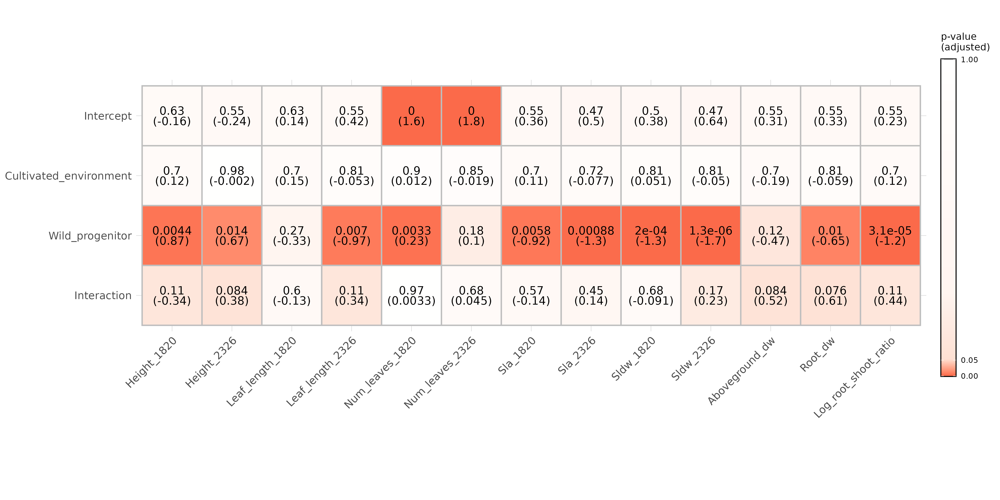

```{r setup, include=FALSE}
knitr::opts_chunk$set(echo = F, message = F, warning = F, cache = F, 
                      cache.path =  "/home/benjamin/Documents/Brassicas_repo/Brassicas_cache/Cache")
knitr::opts_knit$set(root.dir = "/home/benjamin/Documents/Brassicas_repo")
```

```{r load-morphology-libraries, eval = TRUE, echo = FALSE, include = FALSE}
# get libraries
basic_libraries = c("tidyverse",
                    "RColorBrewer",
                    "reshape2",
                    "DHARMa",
                    "lme4",
                    "lmerTest",
                    "grid",
                    "gridExtra",
                    "lattice")
for(lib in basic_libraries){
  if(require(package = lib, character.only = TRUE)){
    print("Successful")
  }else{print("Installing")
    install.packages(lib, Ncpus = 6)
    library(lib, character.only = TRUE)}
}
#prevent other packages overriding dplyr's select
select = dplyr::select
#set working directory
setwd("/home/benjamin/Documents/Brassicas_repo")
```

## Data import, pre-filtering and QC

```{r import-morphology-data}
# import data
phenodata.gen2 = read.delim("Data/Phenotypic_data/morphology_data_gen2.txt", sep = ",", header = T, row.names = NULL)

# remove unused columns
phenodata.gen2 = select(phenodata.gen2, -c("Total_la"))

# change the environment labels to something less verbose
phenodata.gen2$Environment =  ifelse(phenodata.gen2$Environment == "wheat competition", "wheat", "control")
# for now simplify down to wild vs domesticated
phenodata.gen2$Wild_Dom =  ifelse(phenodata.gen2$Wild_Dom == "Wild", "Wild", "Cultivated")
# simplify the parental effects status data
phenodata.gen2$Parental_effects_status = ifelse(phenodata.gen2$Parental_effects_status == "standardised",
                                                            "standardised","unstandardised")
# munra and mungra are almost certainly the same species, divided by a typo, so combine these
phenodata.gen2$Species[which(phenodata.gen2$Species=="Raphanus_raphanistrum_mungra")] = "Raphanus_raphanistrum_munra"

# for some factors, we need to take into account timepoint of measurement
table(phenodata.gen2$Days_meas_taken)
phenodata.gen2$DayMeasured = ifelse(phenodata.gen2$Days_meas_taken %in% c(18:20,23:26), 
                                    ifelse(phenodata.gen2$Days_meas_taken %in% c(18:20), 
                                           "d18to20", "d23to26"), NA)
#subset height, num leaves, sla, sldw, leaf length based on measure data
repeated.measures = c("Height","Leaf_length","Num_leaves","Sla","Sldw")
#new cols for days 18-20
newcols = select(phenodata.gen2, repeated.measures)
newcols[which(phenodata.gen2$DayMeasured != "d18to20"),] = NA
colnames(newcols) = paste0(colnames(newcols),"_1820")
phenodata.gen2 = cbind(phenodata.gen2, newcols)
#new cols for days 23-26
newcols = select(phenodata.gen2, repeated.measures)
newcols[which(phenodata.gen2$DayMeasured != "d23to26"),] = NA
colnames(newcols) = paste0(colnames(newcols),"_2326")
phenodata.gen2 = cbind(phenodata.gen2, newcols)
#remove old, now-defunct measure cols
phenodata.gen2 = select(phenodata.gen2, -repeated.measures)

# take note of the most relevant measured variables
measure.vars = c("Days_germ", #days from potting to germination
                 "Height_1820", #max distance from soil to plant
                 "Height_2326",
                 "Leaf_length_1820", #base to tip of longest non-cotyledon
                 "Leaf_length_2326",
                 "Num_leaves_1820", #number of leaves
                 "Num_leaves_2326", 
                 "Sla_1820", #single leaf area of oldest non-cotyledon
                 "Sla_2326",
                 "Sldw_1820", #single lead dry weight of oldest non-cotyledon
                 "Sldw_2326",
                 #"Sp_la", #specific leaf area
                 "Aboveground_dw", #all biomass above soil
                 #"Day_flowering", #days from germination to flowering
                 "Root_dw", #all biomass below soil
                 #"Total_biomass", #sum of above and below ground biomass
                 "Root_to_shoot_ratio" #ratio of below to above-ground biomass (I think)
) 

# convert to numeric where applicable
phenodata.gen2.clean =  mutate_at(phenodata.gen2, measure.vars, function(x) as.numeric(as.character(x))) %>%
  select(c("Label_front","Species","Population","Wild_Dom","Environment","Parental_effects_status",measure.vars)) 


#refactor to set reference levels
phenodata.gen2.clean$Wild_Dom = factor(phenodata.gen2.clean$Wild_Dom, c("Wild","Cultivated"))
phenodata.gen2.clean$Environment = factor(phenodata.gen2.clean$Environment, c("wheat","control"))

#narrow to spp
phenodata.gen2.clean.brass = subset(phenodata.gen2.clean, substr(Species,1,3)=="Bra")
phenodata.gen2.clean.raph = subset(phenodata.gen2.clean, substr(Species,1,3)=="Rap")
```

Check trait distributions for Brassica:

```{r brass-distribution-qc}
#Begin by checking distributions for each variable, to check nothing fishy is going on
brassmelt = melt(phenodata.gen2.clean.brass, id.vars = "Population", measure.vars = measure.vars)
gg.brass.hist = ggplot(brassmelt, aes(x=value))+
  geom_histogram() +
  facet_wrap(~variable, scales = "free")
gg.brass.hist
```

And for Raphanus:

```{r raph-distribution-qc}
#Repeat for raph
raphmelt = melt(phenodata.gen2.clean.raph, id.vars = "Population", measure.vars = measure.vars)
gg.raph.hist = ggplot(raphmelt, aes(x=value))+
  geom_histogram() +
  facet_wrap(~variable, scales = "free")
gg.raph.hist
```

What's going on with root dry weight in these plots? It looks unimodal, but the scale seems off, perhaps indicating outliers. Sure enough,if we look at the quantile distributions for dry weight there are definitely outliers here, which we can reasonably attribute to experimental error given the sensitivity of the weighing to e.g. residual moisture in the roots. 

```{r root-dw-quantiles}
quantile(phenodata.gen2.clean.brass$Root_dw, c(seq(0,0.75,0.25),0.95,1), na.rm=T)
quantile(phenodata.gen2.clean.raph$Root_dw, c(seq(0,0.75,0.25),0.95,1), na.rm=T)
```

To be safe, we'll remove values for root dry weight that are more than 3 standard deviations above the mean.

```{r remove-dw-outliers}
#quick function to remove values 3+ SDs above the mean
crude_outliercheck = function(x){
  sd = sd(x, na.rm=T)
  mean = mean(x, na.rm=T)
  upper = (mean + sd*3)
  print("Removing values: ");print(paste(x[which(x>upper)]))
  x[which(x>upper)] = NA
  return(x)
}
#apply function to rmeove these obvious outliers
phenodata.gen2.clean.brass$Root_dw = crude_outliercheck(phenodata.gen2.clean.brass$Root_dw)
phenodata.gen2.clean.raph$Root_dw = crude_outliercheck(phenodata.gen2.clean.raph$Root_dw)
#also set root-shoot ratio to NA for these outliers
phenodata.gen2.clean.brass$Root_to_shoot_ratio[which(is.na(phenodata.gen2.clean.brass$Root_dw))] = NA
phenodata.gen2.clean.raph$Root_to_shoot_ratio[which(is.na(phenodata.gen2.clean.raph$Root_dw))] = NA
```

How do the disributions look now for Brassica and for Raphanus?

```{r distribution-qc-secondpass}
#Re-check distributions for each variable
brassmelt = melt(phenodata.gen2.clean.brass, id.vars = "Population", measure.vars = measure.vars)
gg.brass.hist = ggplot(brassmelt, aes(x=value))+
  geom_histogram() +
  facet_wrap(~variable, scales = "free")
gg.brass.hist
#Repeat for raph
raphmelt = melt(phenodata.gen2.clean.raph, id.vars = "Population", measure.vars = measure.vars)
gg.raph.hist = ggplot(raphmelt, aes(x=value))+
  geom_histogram() +
  facet_wrap(~variable, scales = "free")
gg.raph.hist
```

Root dry weight looks better now, but root-shoot ratio is still very skewed- not surprising for a ratio like this. If we log the ratio, it looks much better:

```{r plot-logged-ratios}
hist(log(phenodata.gen2.clean.brass$Root_to_shoot_ratio)); hist(log(phenodata.gen2.clean.raph$Root_to_shoot_ratio))
#okay, let's create a logged ratio
phenodata.gen2.clean.brass$Log_root_shoot_ratio = log(phenodata.gen2.clean.brass$Root_to_shoot_ratio)
phenodata.gen2.clean.raph$Log_root_shoot_ratio = log(phenodata.gen2.clean.raph$Root_to_shoot_ratio)
#update the measure.vars object (also drop traits that remain clearly unimodal)
measure.vars.brass = c(measure.vars[!(measure.vars %in% c("Days_germ","Root_to_shoot_ratio"))],"Log_root_shoot_ratio")
measure.vars.raph = c(measure.vars[!(measure.vars %in% c("Days_germ","Root_to_shoot_ratio"))],"Log_root_shoot_ratio")

```

We'll use logged root-shoot ratio instead of the unmodified ratio henceforth. We'll also drop days to germination, since this is clearly a highly unimodal trait. 


## Trait model testing

We'd now like to fit the data for each trait so that we can plug our data into mixed models down the line. In an ideal world each trait would be fit reasonably well by a normal distribution- let's see if that's the case. What we're looking for: 

1. Points fitted nicely along the QQ plot abline
2. Even distribution about abline in fitted vs residuals plot
3. Roughly horizontal fit for scale-location plot
4. No outiers in residuals vs leverage plot

First for Brassica traits:

```{r modeltesting-gauss-brassica, fig.show="hold", results='asis'}
for(i in 1:length(measure.vars.brass)){
  
  response.var = measure.vars.brass[i]
  phenodata.gen2.clean.brass.omit = subset(phenodata.gen2.clean.brass, is.na(get(response.var))==F)
  model.gauss = lmer(scale(get(response.var))~Environment + Wild_Dom + Environment:Wild_Dom + (1|Population), 
                     data=phenodata.gen2.clean.brass.omit, 
                     control = lmerControl(optimizer="bobyqa", optCtrl = list(maxfun = 10000)))

  #qq plot
  plot.qq = qqmath(model.gauss,
                   main="Q-Q plot", font.main=1)
  #fitted vs residuals plot
  plot.fitres = plot(model.gauss, type=c("p","smooth"), col.line=1, 
                     main="Fitted vs residuals", font.main=1)
  #scale-location plot
  plot.scaloc = plot(model.gauss,
     sqrt(abs(resid(.)))~fitted(.),
     type=c("p","smooth"), col.line=1, 
     main="Scale-location",font.main=1)
  #residuals vs leverage
  plot.reslev = plot(model.gauss, rstudent(.) ~ hatvalues(.),
                     main="Residuals vs leverage",font.main=1)
  #return plots
  grid.arrange(plot.qq,
               plot.fitres,
               plot.scaloc,
               plot.reslev,
               top=grid::textGrob(response.var, gp=grid::gpar(fontsize=18,font=2)))

}

```

Then for Raphanus traits:

```{r modeltesting-gauss-raphanus, fig.show="hold", results='asis'}
for(i in 1:length(measure.vars.raph)){
  
  response.var = measure.vars.raph[i]
  phenodata.gen2.clean.raph.omit = subset(phenodata.gen2.clean.raph, is.na(get(response.var))==F)
  model.gauss = lmer(scale(get(response.var))~Environment + Wild_Dom + Environment:Wild_Dom + (1|Population), 
                     data=phenodata.gen2.clean.raph.omit, 
                     control = lmerControl(optimizer="bobyqa", optCtrl = list(maxfun = 10000)))

  #qq plot
  plot.qq = qqmath(model.gauss,
                   main="Q-Q plot", font.main=1)
  #fitted vs residuals plot
  plot.fitres = plot(model.gauss, type=c("p","smooth"), col.line=1, 
                     main="Fitted vs residuals", font.main=1)
  #scale-location plot
  plot.scaloc = plot(model.gauss,
     sqrt(abs(resid(.)))~fitted(.),
     type=c("p","smooth"), col.line=1, 
     main="Scale-location",font.main=1)
  #residuals vs leverage
  plot.reslev = plot(model.gauss, rstudent(.) ~ hatvalues(.),
                     main="Residuals vs leverage",font.main=1)
  #return plots
  grid.arrange(plot.qq,
               plot.fitres,
               plot.scaloc,
               plot.reslev,
               top=grid::textGrob(response.var, gp=grid::gpar(fontsize=18,font=2)))

}

```


While none of these fits are perfect, the only massive issues are with number of leaves, since this is a discrete integer trait and thus fits weirdly to a gaussian distribution. For this trait, we might be better off fitting a Poisson distribution:

```{r modeltesting-poisson-brassica, fig.show="hold", results='asis', fig.height = 5}
discrete.traits = c("Num_leaves_1820","Num_leaves_2326")

for(i in 1:length(discrete.traits)){
  
  response.var = discrete.traits[i]
  phenodata.gen2.clean.brass.omit = subset(phenodata.gen2.clean.brass, is.na(get(response.var))==F)
  model.gauss = glmer(get(response.var)~Environment + Wild_Dom + Environment:Wild_Dom + (1|Population), 
                     data=phenodata.gen2.clean.brass.omit, 
                     control = glmerControl(optimizer="bobyqa", optCtrl = list(maxfun = 10000)),family = poisson())

  #qq plot
  plot.qq = qqmath(model.gauss,
                   main="Q-Q plot", font.main=1)
  #fitted vs residuals plot
  plot.fitres = plot(model.gauss, type=c("p","smooth"), col.line=1, 
                     main="Fitted vs residuals", font.main=1)
  #return plots
  grid.arrange(plot.qq,
               plot.fitres,
               ncol=2,
               top=grid::textGrob(response.var, gp=grid::gpar(fontsize=18,font=2)))

}

```

This doesn't necessarily look better, but it does make more sense (number of leaves is much more likely to be poisson distributed than gaussian, since it's a discrete trait) so for num leaves we'll use a poisson distribution going forward in place of a gaussian. 

The other trait that looks odd in the above diagnostic plots is root dry-weight. We already know that this trait suffers from some skew, but we'd hoped to improve that by removing outliers earlier. Perhaps some kind of inverse link function could help with this?

```{r modeltesting-inverse-brassica, fig.show="hold", results='asis', fig.height = 5}
  response.var = "Root_dw"
  phenodata.gen2.clean.brass.omit = subset(phenodata.gen2.clean.brass, is.na(get(response.var))==F)
  model.gauss = glmer(get(response.var)~Environment + Wild_Dom + Environment:Wild_Dom + (1|Population), 
                     data=phenodata.gen2.clean.brass.omit, 
                     control = glmerControl(optimizer="bobyqa", optCtrl = list(maxfun = 10000)),family=gaussian(link="inverse"))
  #qq plot
  plot.qq = qqmath(model.gauss,
                   main="Q-Q plot", font.main=1)
  #fitted vs residuals plot
  plot.fitres = plot(model.gauss, type=c("p","smooth"), col.line=1, 
                     main="Fitted vs residuals", font.main=1)
  #return plots
  grid.arrange(plot.qq,
               plot.fitres,
               ncol=2,
               top=grid::textGrob(response.var, gp=grid::gpar(fontsize=18,font=2)))
```

That doesn't look any better. What about a gamma distribution?

```{r modeltesting-gamma-brassica, fig.show="hold", results='asis', fig.height = 5}
model.gauss = glmer(get(response.var)~Environment + Wild_Dom + Environment:Wild_Dom + (1|Population), 
                     data=phenodata.gen2.clean.brass.omit, 
                     control = glmerControl(optimizer="bobyqa", optCtrl = list(maxfun = 10000)),family=Gamma())

  #qq plot
  plot.qq = qqmath(model.gauss,
                   main="Q-Q plot", font.main=1)
  #fitted vs residuals plot
  plot.fitres = plot(model.gauss, type=c("p","smooth"), col.line=1, 
                     main="Fitted vs residuals", font.main=1)
  #return plots
  grid.arrange(plot.qq,
               plot.fitres,
               ncol=2,
               top=grid::textGrob(response.var, gp=grid::gpar(fontsize=18,font=2)))
```

Even worse! Okay, there doesn't seem to be any way to fit this trait nicely, so let's just model it with a gaussian distribution but take the results with a pinch of salt.

## Parental effects testing

Before running any other models, we'd like to check if any traits exhibit strong differences between those accessions with parental effect standardization and those without. Note that for Raphanus, all species/subspecies have both standardised and unstandardised samples, so we can just compare all against all, whereas for Brassica standardisation is present only for some B rapa (both wild and domesticated) so we need to subset before running the comparison. 

First for the Brassicas:
```{r parental-effects-brassica}
#subset to rapas
phenodata.gen2.clean.brass.subset = subset(phenodata.gen2.clean.brass, Species == "Brassica_rapa")

for(i in 1:length(measure.vars.brass)){
  
  #get trait
  response.var = measure.vars.brass[i]
  #check whether trait is discrete
  isDiscrete = response.var %in% discrete.traits
  #remove NAs
  phenodata.gen2.clean.brass.omit = subset(phenodata.gen2.clean.brass.subset, is.na(get(response.var))==F)
  #run model
  if(isDiscrete){
    model = glmer(get(response.var) ~ Parental_effects_status + (1|Population), 
                  data=phenodata.gen2.clean.brass.omit, family = poisson(),
                  control = glmerControl(optimizer="bobyqa", optCtrl = list(maxfun = 10000)))
    out = signif(data.frame(summary(model)$coefficients)[2,4],3)
    print(paste0("Parental effects p for ",response.var," in Brassica rapa: ",out))
  } else {
    model = lmer(get(response.var) ~ Parental_effects_status + (1|Population), 
                 data=phenodata.gen2.clean.brass.omit,
                 control = lmerControl(optimizer="bobyqa", optCtrl = list(maxfun = 10000)))
    out = signif(data.frame(summary(model)$coefficients)[2,5],3)
    print(paste0("Parental effects p for ",response.var," in Brassica rapa: ",out))
  }
  
}
```

And for Raphanus:

```{r parental-effects-raphanus}
for(i in 1:length(measure.vars.raph)){
  
  #get trait
  response.var = measure.vars.raph[i]
  #check whether trait is discrete
  isDiscrete = response.var %in% discrete.traits
  #remove NAs
  phenodata.gen2.clean.raph.omit = subset(phenodata.gen2.clean.raph, is.na(get(response.var))==F)
  #run model
  if(isDiscrete){
    model = glmer(get(response.var) ~ Parental_effects_status + (1|Population), 
                  data=phenodata.gen2.clean.raph.omit, family = poisson())
    out = signif(data.frame(summary(model)$coefficients)[2,4],3)
    print(paste0("Parental effects p for ",response.var," in Raphanus: ",out))
  } else {
    model = lmer(get(response.var) ~ Parental_effects_status + (1|Population), 
                 data=phenodata.gen2.clean.raph.omit)
    out = signif(data.frame(summary(model)$coefficients)[2,5],3)
    print(paste0("Parental effects p for ",response.var," in Raphanus: ",out))
  }
  
}
```

The large majority of traits in both Raphanus and Brassica display some kind of parental effect, so we will have to include parental standardisation status as a random effect in our subsequent models. 

## Work package 1: Comparing domesticates to their wild progenitors

For this work package, we wish to compare wild progenitor species to modern domesticates. For Brassica, the comparison is between domesticated B rapa with wild B rapa, while for Raphanus the comparison is between R raphanistrum (wild) and all other Raphanus samples, all of which appear to be domesticated. Our analytic design is: 
  
  $$expression \sim domestication + treatment + domestication*treatment + (1|population) + (1|parental\ standardization\ status)$$

```{r brassica-morphology-dom-vs-progenitor-models}
#loop over traits and save model outputs
for(i in 1:length(measure.vars.brass)){
  #get trait of interest
  response.var = measure.vars.brass[i]
  isDiscrete = response.var %in% discrete.traits
  #remove NAs
  phenodata.gen2.clean.brass.omit = subset(phenodata.gen2.clean.brass.subset, is.na(get(response.var))==F)
  #run poisson if trait is discretised, otherwise run gaussian
  if(isDiscrete){
    model.out = glmer(get(response.var)~Environment + Wild_Dom + Environment:Wild_Dom + 
                          (1|Population) + (1|Parental_effects_status), 
                        data=phenodata.gen2.clean.brass.omit,family = poisson(),
                        control = glmerControl(optimizer="bobyqa", optCtrl = list(maxfun = 10000)))
    out = summary(model.out)
    pvals = data.frame(out$coefficients[,"Pr(>|z|)"])
    ests = data.frame(out$coefficients[,"Estimate"])
  }else{
    model.out = lmer(scale(get(response.var))~Environment + Wild_Dom + Environment:Wild_Dom +
                         (1|Population) + (1|Parental_effects_status), 
                       data=phenodata.gen2.clean.brass.omit, 
                       control = lmerControl(optimizer="bobyqa", optCtrl = list(maxfun = 10000)))
    out = summary(model.out)
    pvals = data.frame(out$coefficients[,"Pr(>|t|)"])
    ests = data.frame(out$coefficients[,"Estimate"])
  }
  #record output
  if(i==1){pvals.out = pvals; ests.out = ests}else{
    pvals.out = cbind(pvals.out,pvals); ests.out = cbind(ests.out,ests)}

}
#set dimnames for outputs
dimnames(pvals.out)=list(c("Intercept","Cultivated_environment","Domesticated_history","Interaction"),measure.vars.brass)
dimnames(ests.out)=list(c("Intercept","Cultivated_environment","Domesticated_history","Interaction"),measure.vars.brass)
```

```{r brassica-morphology-dom-vs-progenitor-plotting}
#adjust p-vlaues
pvals.out = data.frame(t(apply(pvals.out,1,function(x) p.adjust(x, "BH"))))

#get labels for plot
brassica.subset.coef.labels = paste0(as.matrix(signif(pvals.out,2)),"\n(",as.matrix(signif(ests.out,2)),")")

#coerce df for ggplot and apply FDR correction
brassica.subset.coefs.fdr = reshape2::melt(rownames_to_column(pvals.out)) #%>% mutate(value = p.adjust(value, method = "BH"))

#plot
brassica.subset.traits.fdr.plot = ggplot(data = brassica.subset.coefs.fdr, aes(x = variable, 
                                                                               y = factor(rowname,levels = c("Interaction",
                                                                                                             "Domesticated_history",
                                                                                                             "Cultivated_environment",
                                                                                                             "Intercept")), fill = value)) +
  geom_tile(aes(fill = value),color = "gray", size=.75, width=1, height = 1) +
  geom_text(aes(label=c(brassica.subset.coef.labels), 
                lineheight = 0.75, size = 2), show.legend = FALSE) +
  scale_fill_gradientn(colours = colorRampPalette(rev(c("#FFFFFF",brewer.pal(n = 9, name = "Reds")[1:5])),bias=6)(20),
                       breaks = c(0.0,0.05,1),
                       expand = c(0,0),
                       limits = c(0,1),
                       guide = guide_colourbar(barheight = 25,
                                               #title = "p-value\n(adjusted)",
                                               title = "p-value\n(adjusted)",
                                               title.vjust = 2,
                                               frame.colour = "black", 
                                               frame.linewidth = 1.5)) +
  theme_minimal() + 
  theme(#aspect.ratio = 1,
    panel.grid = element_line(size = 0.2, colour = "gray80"),
    axis.text.x = element_text(angle = 45, vjust = 1, size = 12, hjust = 1),
    axis.text.y = element_text(size = 12),
    axis.title = element_blank()#,
    #legend.text = element_text(size=12),
    #legend.title = element_text(size=15, face = "bold")
  ) + coord_fixed()

ggsave(brassica.subset.traits.fdr.plot, filename = "phenotypic_lmer_pvals_brassica_subset.png",
       device = "png", path = "Analysis/Phenotypic_analysis/Images",
       width =  40, height = 20, units = "cm")

knitr::include_graphics("Analysis/Phenotypic_analysis/Images/phenotypic_lmer_pvals_brassica_subset.png")
```

Our primary interest is in the bottom row, since significant terms here will indicate traits that exhibit differential plasticity in domesticated vs wild rapa. However, none of these interaction terms are significant. Nor, indeed, are any traits significantly different between wild and domesticated rapa overall, which is very surprising!

Let's try the same analysis for Raphanus, comparing R raphanistrum to the various domesticated Raphanus using the same model. 

```{r raphanus-morphology-dom-vs-progenitor-models}
#loop over traits and save model outputs
for(i in 1:length(measure.vars.raph)){
  #get trait of interest
  response.var = measure.vars.raph[i]
  isDiscrete = response.var %in% discrete.traits
  #remove NAs
  phenodata.gen2.clean.raph.omit = subset(phenodata.gen2.clean.raph, is.na(get(response.var))==F)
  #run poisson if trait is discretised, otherwise run gaussian
  if(isDiscrete){
    model.out = glmer(get(response.var)~Environment + Wild_Dom + Environment:Wild_Dom + 
                          (1|Population) + (1|Parental_effects_status), 
                        data=phenodata.gen2.clean.raph.omit,family = poisson(),
                        control = glmerControl(optimizer="bobyqa", optCtrl = list(maxfun = 10000)))
    out = summary(model.out)
    pvals = data.frame(out$coefficients[,"Pr(>|z|)"])
    ests = data.frame(out$coefficients[,"Estimate"])
  }else{
    model.out = lmer(scale(get(response.var))~Environment + Wild_Dom + Environment:Wild_Dom +
                         (1|Population) + (1|Parental_effects_status), 
                       data=phenodata.gen2.clean.raph.omit, 
                       control = lmerControl(optimizer="bobyqa", optCtrl = list(maxfun = 10000)))
    out = summary(model.out)
    pvals = data.frame(out$coefficients[,"Pr(>|t|)"])
    ests = data.frame(out$coefficients[,"Estimate"])
  }
  #record output
  if(i==1){pvals.out = pvals; ests.out = ests}else{
    pvals.out = cbind(pvals.out,pvals); ests.out = cbind(ests.out,ests)}

}
#set dimnames for outputs
dimnames(pvals.out)=list(c("Intercept","Cultivated_environment","Domesticated_history","Interaction"),measure.vars.raph)
dimnames(ests.out)=list(c("Intercept","Cultivated_environment","Domesticated_history","Interaction"),measure.vars.raph)
```

```{r raphanus-morphology-dom-vs-progenitor-plotting}
#adjust p-vlaues
pvals.out = data.frame(t(apply(pvals.out,1,function(x) p.adjust(x, "BH"))))

#get labels for plot
raphanus.subset.coef.labels = paste0(as.matrix(signif(pvals.out,2)),"\n(",as.matrix(signif(ests.out,2)),")")

#coerce df for ggplot and apply FDR correction
raphanus.subset.coefs.fdr = reshape2::melt(rownames_to_column(pvals.out)) #%>% mutate(value = p.adjust(value, method = "BH"))

#plot
raphanus.subset.traits.fdr.plot = ggplot(data = raphanus.subset.coefs.fdr, aes(x = variable, 
                                                                               y = factor(rowname,levels = c("Interaction",
                                                                                                             "Domesticated_history",
                                                                                                             "Cultivated_environment",
                                                                                                             "Intercept")), fill = value)) +
  geom_tile(aes(fill = value),color = "gray", size=.75, width=1, height = 1) +
  geom_text(aes(label=c(raphanus.subset.coef.labels), 
                lineheight = 0.75, size = 2), show.legend = FALSE) +
  scale_fill_gradientn(colours = colorRampPalette(rev(c("#FFFFFF",brewer.pal(n = 9, name = "Reds")[1:5])),bias=6)(20),
                       breaks = c(0.0,0.05,1),
                       expand = c(0,0),
                       limits = c(0,1),
                       guide = guide_colourbar(barheight = 25,
                                               #title = "p-value\n(adjusted)",
                                               title = "p-value\n(adjusted)",
                                               title.vjust = 2,
                                               frame.colour = "black", 
                                               frame.linewidth = 1.5)) +
  theme_minimal() + 
  theme(#aspect.ratio = 1,
    panel.grid = element_line(size = 0.2, colour = "gray80"),
    axis.text.x = element_text(angle = 45, vjust = 1, size = 12, hjust = 1),
    axis.text.y = element_text(size = 12),
    axis.title = element_blank()#,
    #legend.text = element_text(size=12),
    #legend.title = element_text(size=15, face = "bold")
  ) + coord_fixed()

ggsave(raphanus.subset.traits.fdr.plot, filename = "phenotypic_lmer_pvals_raphanus_subset.png",
       device = "png", path = "Analysis/Phenotypic_analysis/Images",
       width =  40, height = 20, units = "cm")

knitr::include_graphics("Analysis/Phenotypic_analysis/Images/phenotypic_lmer_pvals_raphanus_subset.png")
```

Again, we reach the unfortunate conclusion that there seem to be no significant terms in any of the models. Might we find some if we subset by the separate Raphanus domesticates, rather than combining them all into one? Below we plot the interaction terms only for each comparison.

```{r raphanus-morphology-dom-vs-progenitor-perspecies-models}
#subset raphanus
raph.domesticates = unique(phenodata.gen2.clean.raph$Species)[which(unique(phenodata.gen2.clean.raph$Species)!="Raphanus_raphanistrum")]
#loop across domesticates, comparing to raphanistrum
for(j in 1:length(raph.domesticates)){
  focaldom = raph.domesticates[j]
  
  #subset to just progenitor and chosen dom, then list whether raphanistrum or not
  phenodata.gen2.clean.raph.focalpair = subset(phenodata.gen2.clean.raph, Species %in% c("Raphanus_raphanistrum",focaldom))
  phenodata.gen2.clean.raph.focalpair$Progenitor = ifelse(phenodata.gen2.clean.raph.focalpair$Species == "Raphanus_raphanistrum",TRUE,FALSE)
  
  #loop across each each phenotypic variable
  for(i in 1:length(measure.vars.raph)){
    
    #get variable and check if discretised
    response.var = measure.vars.raph[i]
    isDiscrete = response.var %in% discrete.traits
    #remove NAs
    phenodata.gen2.clean.raph.omit = subset(phenodata.gen2.clean.raph.focalpair, is.na(get(response.var))==F)

    #run poisson if trait is discretised, otherwise run gaussian
    if(isDiscrete){
      model.out = glmer(get(response.var)~Environment + Wild_Dom + Environment:Wild_Dom + 
                          (1|Population) + (1|Parental_effects_status), 
                        data=phenodata.gen2.clean.raph.omit,family = poisson(),
                        control = glmerControl(optimizer="bobyqa", optCtrl = list(maxfun = 10000)))
      #extract info regarding interaction term
      out = summary(model.out)
      outinter = data.frame(out$coefficients["Environmentcontrol:Wild_DomCultivated",c("Pr(>|z|)","Estimate")]) 
    }else{
      model.out = lmer(scale(get(response.var))~Environment + Wild_Dom + Environment:Wild_Dom +
                         (1|Population) + (1|Parental_effects_status), 
                       data=phenodata.gen2.clean.raph.omit, 
                       control = lmerControl(optimizer="bobyqa", optCtrl = list(maxfun = 10000)))
      #extract info regarding interaction term
      out = summary(model.out)
      outinter = data.frame(out$coefficients["Environmentcontrol:Wild_DomCultivated",c("Pr(>|t|)","Estimate")]) 
    }
    
    #save loop output
    if(i==1){outframe = outinter}else{outframe = cbind(outframe,outinter)}
    
  }
  
  #collate info per spp loop
  dimnames(outframe)=list(c("pval","estimate"),measure.vars.raph)
  if(j==1){pvals.out = outframe["pval",]; ests.out = outframe["estimate",]}else{
    pvals.out = rbind(pvals.out,outframe["pval",]); ests.out = rbind(ests.out,outframe["estimate",])}
}

#rename
row.names(pvals.out) = raph.domesticates ; row.names(ests.out) = raph.domesticates 
```

```{r raphanus-morphology-dom-vs-progenitor-perspecies-plotting}
#adjust p-vlaues (across all comparisons, not just rows or )
pvals.out.fdr = pvals.out %>% 
  as.matrix %>% 
  as.vector %>% 
  p.adjust(method='BH') %>% 
  matrix(nrow=3) %>%
  data.frame() %>%
  'dimnames<-'(dimnames(pvals.out))

#get labels for plot
raph.wilds.coefs.labels = paste0(as.matrix(signif(pvals.out.fdr,2)),"\n(",as.matrix(signif(ests.out,2)),")")

#coerce df for ggplot 
raph.wilds.coefs.fdr = reshape2::melt(rownames_to_column(pvals.out.fdr)) 

#plot
raph.wilds.speciesinteractions.fdr.plot = ggplot(data = raph.wilds.coefs.fdr, aes(x = variable,  y = rowname,  fill = value)) +
  geom_tile(aes(fill = value),color = "gray", size=.75, width=1, height = 1) +
  geom_text(aes(label=c(raph.wilds.coefs.labels), 
                lineheight = 0.75, size = 2), show.legend = FALSE) +
  scale_fill_gradientn(colours = colorRampPalette(rev(c("#FFFFFF",brewer.pal(n = 9, name = "Reds")[1:5])),bias=6)(20),
                       breaks = c(0.0,0.05,1),
                       expand = c(0,0),
                       limits = c(0,1),
                       guide = guide_colourbar(barheight = 25,
                                               #title = "p-value\n(adjusted)",
                                               title = "p-value\n(adjusted)",
                                               title.vjust = 2,
                                               frame.colour = "black", 
                                               frame.linewidth = 1.5)) +
  theme_minimal() + 
  theme(#aspect.ratio = 1,
    panel.grid = element_line(size = 0.2, colour = "gray80"),
    axis.text.x = element_text(angle = 45, vjust = 1, size = 12, hjust = 1),
    axis.text.y = element_text(size = 12),
    axis.title = element_blank()#,
    #legend.text = element_text(size=12),
    #legend.title = element_text(size=15, face = "bold")
  ) +
  coord_fixed()

ggsave(raph.wilds.speciesinteractions.fdr.plot, filename = "phenotypic_lmer_pvals_raph_doms_perspecies.png",
       device = "png", path = "Analysis/Phenotypic_analysis/Images",
       width =  40, height = 20, units = "cm")

knitr::include_graphics("Analysis/Phenotypic_analysis/Images/phenotypic_lmer_pvals_raph_doms_perspecies.png")
```

To the contrary, subsetting by domesticate further erases any traces of interaction significance that we might have found for Raphanus (not least because we have to apply FDR correction over 3 x 13 = 39 comparisons here). 

We must therefore conclude that domestication hasn't selected for greeater phenotypic plasticity in domesticates relative to their wild progenitors. 

## Work package 2: Comparing wild progenitors to never-domesticated wild species

We now wish to ask a different question: do 'progenitor species' (i.e. those that were the original targets of human selection) differ systematically in their patterns of phenotypic expression from wild species that were never domesticated? We are particularly interested in knowing whether progenitor species express greater phenotypic  plasticity than their never-domesticated relatives, since this could suggest that earty human farmers either intentionally or inadvertently targeted species that were particularly receptive to the benefits of cultivation. 

Unfortunately, for Raphanus we have no data for non-domesticated wild species, so this analysis will be restricted to Brassica, comparing wild Brassica rapa to a number of never-domesticated Brassicas. We'll begin by running a lmer/glmer model as before, except that instead of comparing wild to domesticated, we'll compare progenitors to non-progenitors. 

```{r brassica-morphology-progenitor-vs-wilds-models}
#subset to just wild species
phenodata.gen2.clean.brass.wilds = subset(phenodata.gen2.clean.brass,Wild_Dom=="Wild")
phenodata.gen2.clean.brass.wilds$Progenitor = (phenodata.gen2.clean.brass.wilds$Species=="Brassica_rapa")
#make sure that wild is the baseline
phenodata.gen2.clean.brass.wilds$Progenitor = forcats::fct_relevel(as.factor(phenodata.gen2.clean.brass.wilds$Progenitor),"FALSE")

#loop over traits and save model outputs
for(i in 1:length(measure.vars.brass)){
  #get trait of interest
  response.var = measure.vars.brass[i]
  isDiscrete = response.var %in% discrete.traits
  #remove NAs
  phenodata.gen2.clean.brass.omit = subset(phenodata.gen2.clean.brass.wilds, is.na(get(response.var))==F)
  #run poisson if trait is discretised, otherwise run gaussian
  if(isDiscrete){
    model.out = glmer(get(response.var)~Environment + Progenitor + Environment:Progenitor + 
                          (1|Population) + (1|Parental_effects_status), 
                        data=phenodata.gen2.clean.brass.omit,family = poisson(),
                        control = glmerControl(optimizer="bobyqa", optCtrl = list(maxfun = 10000)))
    out = summary(model.out)
    pvals = data.frame(out$coefficients[,"Pr(>|z|)"])
    ests = data.frame(out$coefficients[,"Estimate"])
  }else{
    model.out = lmer(scale(get(response.var))~Environment + Progenitor + Environment:Progenitor +
                         (1|Population) + (1|Parental_effects_status), 
                       data=phenodata.gen2.clean.brass.omit, 
                       control = lmerControl(optimizer="bobyqa", optCtrl = list(maxfun = 10000)))
    out = summary(model.out)
    pvals = data.frame(out$coefficients[,"Pr(>|t|)"])
    ests = data.frame(out$coefficients[,"Estimate"])
  }
  #record output
  if(i==1){pvals.out = pvals; ests.out = ests}else{
    pvals.out = cbind(pvals.out,pvals); ests.out = cbind(ests.out,ests)}

}
#set dimnames for outputs
dimnames(pvals.out)=list(c("Intercept","Cultivated_environment","Wild_progenitor","Interaction"),measure.vars.brass)
dimnames(ests.out)=list(c("Intercept","Cultivated_environment","Wild_progenitor","Interaction"),measure.vars.brass)
```

```{r brassica-morphology-progenitor-vs-wilds-plotting}
#adjust p-vlaues
pvals.out = data.frame(t(apply(pvals.out,1,function(x) p.adjust(x, "BH"))))

#get labels for plot
brassica.wilds.coef.labels = paste0(as.matrix(signif(pvals.out,2)),"\n(",as.matrix(signif(ests.out,2)),")")

#coerce df for ggplot and apply FDR correction
brassica.wilds.coefs.fdr = reshape2::melt(rownames_to_column(pvals.out)) #%>% mutate(value = p.adjust(value, method = "BH"))

#plot
brassica.wilds.traits.fdr.plot = ggplot(data = brassica.wilds.coefs.fdr, aes(x = variable, 
                                                                               y = factor(rowname,levels = c("Interaction",
                                                                                                             "Wild_progenitor",
                                                                                                             "Cultivated_environment",
                                                                                                             "Intercept")), fill = value)) +
  geom_tile(aes(fill = value),color = "gray", size=.75, width=1, height = 1) +
  geom_text(aes(label=c(brassica.wilds.coef.labels), 
                lineheight = 0.75, size = 2), show.legend = FALSE) +
  scale_fill_gradientn(colours = colorRampPalette(rev(c("#FFFFFF",brewer.pal(n = 9, name = "Reds")[1:5])),bias=6)(20),
                       breaks = c(0.0,0.05,1),
                       expand = c(0,0),
                       limits = c(0,1),
                       guide = guide_colourbar(barheight = 25,
                                               #title = "p-value\n(adjusted)",
                                               title = "p-value\n(adjusted)",
                                               title.vjust = 2,
                                               frame.colour = "black", 
                                               frame.linewidth = 1.5)) +
  theme_minimal() + 
  theme(#aspect.ratio = 1,
    panel.grid = element_line(size = 0.2, colour = "gray80"),
    axis.text.x = element_text(angle = 45, vjust = 1, size = 12, hjust = 1),
    axis.text.y = element_text(size = 12),
    axis.title = element_blank()#,
    #legend.text = element_text(size=12),
    #legend.title = element_text(size=15, face = "bold")
  ) + coord_fixed()

ggsave(brassica.wilds.traits.fdr.plot, filename = "phenotypic_lmer_pvals_brassica_wilds.png",
       device = "png", path = "Analysis/Phenotypic_analysis/Images",
       width =  40, height = 20, units = "cm")


```

This is somewhat more promising: many traits differ in their expression between B rapa and the other wild species, and several of the interaction terms are near-significant. However, to be sure we'll again need to subset by species, since we once again may have lost power by combining distinct species. Below we plot only the interaction terms for each never-domesticated wild:

```{r brassica-morphology-progenitor-vs-wilds-perspecies-models}
#get comparison species
brass.otherwilds = unique(phenodata.gen2.clean.brass$Species)[which(unique(phenodata.gen2.clean.brass$Species)!="Brassica_rapa")]

#loop across wilds, comparing to rapa
for(j in 1:length(brass.otherwilds)){
  focaldom = brass.otherwilds[j]
  
  #subset to just progenitor and chosen wild, then list whether b rapa or not
  phenodata.gen2.clean.brass.focalpair = subset(phenodata.gen2.clean.brass, Species %in% c("Brassica_rapa",focaldom))
  phenodata.gen2.clean.brass.focalpair$Progenitor = ifelse(phenodata.gen2.clean.brass.focalpair$Species == "Brassica_rapa",TRUE,FALSE)
  
  #loop across each each phenotypic variable
  for(i in 1:length(measure.vars.brass)){
    
    #get variable and check if discretised
    response.var = measure.vars.brass[i]
    isDiscrete = response.var %in% discrete.traits
    #remove NAs
    phenodata.gen2.clean.brass.omit = subset(phenodata.gen2.clean.brass.focalpair, is.na(get(response.var))==F)

    #run poisson if trait is discretised, otherwise run gaussian
    if(isDiscrete){
      model.out = glmer(get(response.var)~Environment + Wild_Dom + Environment:Wild_Dom + 
                          (1|Population) + (1|Parental_effects_status), 
                        data=phenodata.gen2.clean.brass.omit,family = poisson(),
                        control = glmerControl(optimizer="bobyqa", optCtrl = list(maxfun = 10000)))
      #extract info regarding interaction term
      out = summary(model.out)
      outinter = data.frame(out$coefficients["Environmentcontrol:Wild_DomCultivated",c("Pr(>|z|)","Estimate")]) 
    }else{
      model.out = lmer(scale(get(response.var))~Environment + Wild_Dom + Environment:Wild_Dom +
                         (1|Population) + (1|Parental_effects_status), 
                       data=phenodata.gen2.clean.brass.omit, 
                       control = lmerControl(optimizer="bobyqa", optCtrl = list(maxfun = 10000)))
      #extract info regarding interaction term
      out = summary(model.out)
      outinter = data.frame(out$coefficients["Environmentcontrol:Wild_DomCultivated",c("Pr(>|t|)","Estimate")]) 
    }
    
    #save loop output
    if(i==1){outframe = outinter}else{outframe = cbind(outframe,outinter)}
    
  }
  
  #collate info per spp loop
  dimnames(outframe)=list(c("pval","estimate"),measure.vars.brass)
  if(j==1){pvals.out = outframe["pval",]; ests.out = outframe["estimate",]}else{
    pvals.out = rbind(pvals.out,outframe["pval",]); ests.out = rbind(ests.out,outframe["estimate",])}
}

#rename
row.names(pvals.out) = brass.otherwilds ; row.names(ests.out) = brass.otherwilds 
```

```{r brassica-morphology-dom-vs-progenitor-perspecies-plotting}
#adjust p-vlaues (across all comparisons, not just rows or columns)
pvals.out.fdr = pvals.out %>% 
  as.matrix %>% 
  as.vector %>% 
  p.adjust(method='BH') %>% 
  matrix(nrow=6) %>%
  data.frame() %>%
  'dimnames<-'(dimnames(pvals.out))

#get labels for plot
brass.wilds.coefs.labels = paste0(as.matrix(signif(pvals.out.fdr,2)),"\n(",as.matrix(signif(ests.out,2)),")")

#coerce df for ggplot 
brass.wilds.coefs.fdr = reshape2::melt(rownames_to_column(pvals.out.fdr)) 

#plot
brass.wilds.speciesinteractions.fdr.plot = ggplot(data = brass.wilds.coefs.fdr, aes(x = variable,  y = rowname,  fill = value)) +
  geom_tile(aes(fill = value),color = "gray", size=.75, width=1, height = 1) +
  geom_text(aes(label=c(brass.wilds.coefs.labels), 
                lineheight = 0.75, size = 2), show.legend = FALSE) +
  scale_fill_gradientn(colours = colorRampPalette(rev(c("#FFFFFF",brewer.pal(n = 9, name = "Reds")[1:5])),bias=6)(20),
                       breaks = c(0.0,0.05,1),
                       expand = c(0,0),
                       limits = c(0,1),
                       guide = guide_colourbar(barheight = 25,
                                               #title = "p-value\n(adjusted)",
                                               title = "p-value\n(adjusted)",
                                               title.vjust = 2,
                                               frame.colour = "black", 
                                               frame.linewidth = 1.5)) +
  theme_minimal() + 
  theme(#aspect.ratio = 1,
    panel.grid = element_line(size = 0.2, colour = "gray80"),
    axis.text.x = element_text(angle = 45, vjust = 1, size = 12, hjust = 1),
    axis.text.y = element_text(size = 12),
    axis.title = element_blank()#,
    #legend.text = element_text(size=12),
    #legend.title = element_text(size=15, face = "bold")
  ) +
  coord_fixed()
#save plot
ggsave(brass.wilds.speciesinteractions.fdr.plot, filename = "phenotypic_lmer_pvals_brass_wilds_perspecies.png",
       device = "png", path = "Analysis/Phenotypic_analysis/Images",
       width =  40, height = 20, units = "cm")
#plot in markdown
knitr::include_graphics("Analysis/Phenotypic_analysis/Images/phenotypic_lmer_pvals_brass_wilds_perspecies.png")
```

Unfortunately, as with the Raphanus domesticates, subsetting by wild species in Brassica results in a total loss of interesting interaction effects. We must therefore conclude that Brassica rapa does not display greater phenotypic plasticity than other wild Brassicaspecies that were never domesticated. 