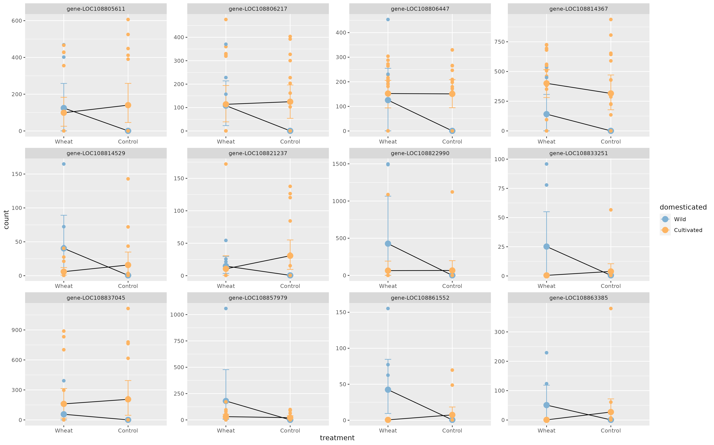
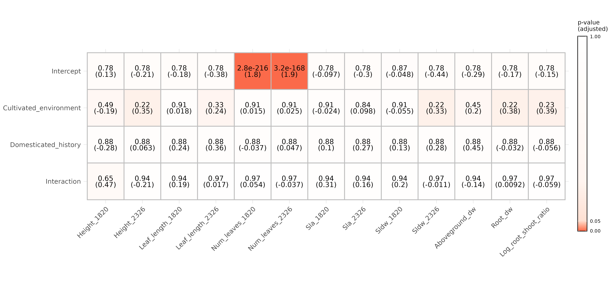

```{r setup, include=FALSE}
knitr::opts_chunk$set(echo = F, message = F, warning = F, cache = F, fig.width = 10, fig.height = 10, out.width="100%",
                      cache.path =  "/home/benjamin/Documents/Brassicas_repo/Brassicas_cache/Cache")
knitr::opts_knit$set(root.dir = "/home/benjamin/Documents/Brassicas_repo")
```

```{r load-morphology-libraries, eval = TRUE, echo = FALSE, include = FALSE}
# get libraries
basic_libraries = c("tidyverse",
                    "RColorBrewer",
                    "grid",
                    "gridExtra",
                    "lattice",
                    "kableExtra")
for(lib in basic_libraries){
  if(require(package = lib, character.only = TRUE)){
    print("Successful")
  }else{print("Installing")
    install.packages(lib, Ncpus = 6)
    library(lib, character.only = TRUE)}
}
#prevent other packages overriding dplyr's select
select = dplyr::select
#set working directory
setwd("/home/benjamin/Documents/Brassicas_repo")
options(knitr.table.format = "simple")
```

This markdown document summarizes the principal results of the Brassica project generation 2 analyses. Analyses are not performed within this document; prior to running this file, the results should be generated by running the two other .Rmd files in this repository: "Brassicas_2021_morphology.Rmd" and "Brassicas_2021_rnaseq.Rmd". 

## Work package 1: Comparing domesticates to their wild progenitors

For this work package, we wish to compare wild progenitor species to modern domesticates. For Brassica, the comparison is between domesticated B rapa with wild B rapa, while for Raphanus the comparison is between R raphanistrum (wild) and all other Raphanus samples, all of which appear to be domesticated.

### Brassica gene expression

For the gene expression analysis, out model design is:

  $$gene expression \sim domestication + treatment + domestication*treatment$$
Results summary (number of genes and GO terms enriched for each dependent variable) for wild vs domesticated Brassica rapa:

```{r}
knitr::kable(read.csv("Analysis/RNAseq/Tables/brassica_deseq_domesticate_vs_progenitor_summary.csv", row.names = 1))
```

And the same analyses after excluding ssp. tricoloris outliers:

```{r}
knitr::kable(read.csv("Analysis/RNAseq/Tables/brassica_deseq_domesticate_vs_progenitor_summary_exclude_weird_tricoloris.csv", row.names = 1))
```

We can see from this that a great many genes are associated with domestication, but few with stress. 41 genes show an interaction between treatment and domestication, and are therefore of particular interest. Summary of the 25 GO terms associated with these interaction genes:

```{r,out.width="70%",fig.align="center"}
knitr::include_graphics("Analysis/RNAseq/Images/brassica_domesticate_vs_progenitor_GO_treeplot.png")
```

We can also plot these interaction terms to get a better idea of what the reaction norms look like for wild and domesticates accessions respectively:

```{r}
knitr::include_graphics("Analysis/RNAseq/Images/brapas_interaction_deg_plots.png")
```

Eyeballing these plots, there's no obvious trend in terms of increases or decreases in plasticity for wild vs domesticated accessions. Let's run statistical tests to check whether this is actually the case:

```{r}
brass.int.table = read.csv("Analysis/RNAseq/brassica_interaction_gene_directionality_table.csv")
check = table(brass.int.table$wild.higher) 
print(paste0("Interaction genes with higher plasticity in wild: ",check[2]))
print(paste0("Interaction genes with higher plasticity in domesticate: ",check[1]))

load("Analysis/RNAseq/brassica_interaction_gene_directionality_ttest.R")
load("Analysis/RNAseq/brassica_interaction_gene_directionality_chisq.R")
load("Analysis/RNAseq/brassica_interaction_gene_directionality_wilcox.R")

knitr::kable(data.frame("Chi-squared"=signif(brass.inter.chisq$p.value,3),
                        "Paired Wilcoxon"=signif(brass.inter.wilcox$p.value,3),
                        "Paired t-test"=signif(brass.inter.t.test$p.value,3)) %>% "row.names<-"("p-value"))
```

From this we must conclude that, in Brassica rapa, genes have not changed systematically in their plasticity in the course of domestication. 

### Raphanus gene expression

Results summary (number of genes and GO terms enriched for each dependent variable) for wild vs domesticated Raphanus:

```{r}
knitr::kable(read.csv("Analysis/RNAseq/Tables/raphanus_deseq_domesticate_vs_progenitor_summary.csv", row.names = 1))
```

And the same analyses after excluding ssp. caudatus outliers:

```{r}
knitr::kable(read.csv("Analysis/RNAseq/Tables/raphanus_deseq_domesticate_vs_progenitor_summary_exclude_weird_caudatus.csv", row.names = 1))
```

Compared to Brassica, we find that fewer genes are associated with domestication, but more with stress. 98 genes show an interaction between treatment and domestication, and are therefore of particular interest. Summary of the 49 GO terms associated with these interaction genes:

```{r,out.width="90%",out.height="90%",fig.align="center"}
knitr::include_graphics("Analysis/RNAseq/Images/raphanus_domesticate_vs_progenitor_GO_treeplot.png")
```

We can also plot these interaction terms to get a better idea of what the reaction norms look like for wild and domesticates accessions respectively:

```{r}

```

Eyeballing these plots, it looks like wild accessions tend to exhibit higher gene expression plasticity than domesticated accessions. Let's run statistical tests to check whether this is actually the case:

```{r}
raph.int.table = read.csv("Analysis/RNAseq/raphanus_interaction_gene_directionality_table.csv")
check = table(raph.int.table$wild.higher) 
print(paste0("Interaction genes with higher plasticity in wild: ",check[2]))
print(paste0("Interaction genes with higher plasticity in domesticate: ",check[1]))

load("Analysis/RNAseq/raphanus_interaction_gene_directionality_ttest.R")
load("Analysis/RNAseq/raphanus_interaction_gene_directionality_chisq.R")
load("Analysis/RNAseq/raphanus_interaction_gene_directionality_wilcox.R")

knitr::kable(data.frame("Chi-squared"=signif(raph.inter.chisq$p.value,3),
                        "Paired Wilcoxon"=signif(raph.inter.wilcox$p.value,3),
                        "Paired t-test"=signif(raph.inter.t.test$p.value,3)) %>% "row.names<-"("p-value"))
```

While the t-test is less conclusive, both the chi-squared and paired Wilcoxon tests strongly suggest that plasticity is higher in wild accessions than in domesticated ones. However, this result might be misleading, because the values for the Raphanus domesticates combine multiple different species, which may have resulted in depressed estimates of gene expression plasticity. For a more robust analysis, we need to run the analysis for each Raphanus domesticate individually.

```{r}
knitr::kable(read.csv("Analysis/RNAseq/Tables/raphanus_interaction_gene_directionality_perspecies_summary.csv")[-1])
```

Again, while the t-test results are less conclusive, per the Wilcox and Chi-squared tests it's clear that for interaction genes plasticity is higher overall in the wild progenitor than in modern domesticates. We must therefore conclude that domestication has selected for decreased gene expression plasticity in radishes. 


### Brassica phenotypic expression

Here, we perform a similar analysis to above but using phenotypic traits instead of genes as the response variable. In each case we use a gaussian linear model, except for leaf number which is analysed using a Poisson model since it's a discrete trait. Here we include random effects, so the model design is:

  $$expression \sim domestication + treatment + domestication*treatment + (1|population) + (1|parental\ standardization\ status)$$

Here we plot the p-values and coefficients (in parentheses) for each independent effect for each trait. FDR correction is applied across each row and response variables are scaled prior to analysis, again with the exception of those modeled using a Poisson distribution. 

```{r}

```

Our primary interest is in the bottom row, since significant terms here will indicate traits that exhibit differential plasticity in domesticated vs wild rapa. However, none of these interaction terms are significant. Nor, indeed, are any traits significantly different between wild and domesticated rapa overall, which is very surprising! However, we're forced to conclude that none of the traits examined appear to have shown a shift in plasticity in the course of Brassica rapa domestication. 

### Raphanus phenotypic expression

```{r}
knitr::include_graphics("Analysis/Phenotypic_analysis/Images/phenotypic_lmer_pvals_raphanus_subset.png")
```

Again, we reach the unfortunate conclusion that there seem to be no significant terms in any of the models. Might we find some if we subset by the separate Raphanus domesticates, rather than combining them all into one? Below we plot the interaction terms only for each comparison:

```{r}

```

To the contrary, subsetting by domesticate further erases any traces of interaction significance that we might have found for Raphanus (not least because we have to apply FDR correction over 3 x 13 = 39 comparisons here). 

We must therefore conclude that domestication hasn't selected for greeater phenotypic plasticity in domesticates relative to their wild progenitors. 

## Work package 2: Comparing wild progenitors to never-domesticated wild species

We now wish to ask a different question: do 'progenitor species' (i.e. those that were the original targets of human selection) differ systematically in their patterns of gene and phenotypic expression from wild species that were never domesticated? We are particularly interested in knowing whether progenitor species express greater phenotypic  plasticity than their never-domesticated relatives, since this could suggest that earty human farmers either intentionally or inadvertently targeted species that were particularly receptive to the benefits of cultivation. Unfortunately, for Raphanus we have no data for non-domesticated wild species, so this analysis will be restricted to Brassica, comparing wild Brassica rapa to a number of never-domesticated Brassicas. 

### Gene expression

We'll begin with the results of a DESeq2 model as before, except that instead of comparing wild to domesticated, we'll compare progenitors (wild Brassica rapa) to non-progenitors (all other wild Brassicas). 

```{r}
knitr::kable(read.csv("Analysis/RNAseq/Tables/brass_wilds_summary.csv",row.names = 1))
```

The results here are similar to those we generated when comparing the wild and domesticated Brassica rapas: many genes dividing the different species, few differing with treatment, and a mid-sized number with interaction terms. Again, our primary interest is in these interaction genes, since these are those that show differential plasticity between the progenitor and its never-domesticated relatives. Plotting the 12 genes with the lowest p-vlaues for this comparison:

```{r}

```

Eyeballing these plots, there's surprisingly little difference in the reaction norms for progenitor and non-progenitor accessions, so it seems likely that the effect sizes we're observing here are quite low despite the small p-values. Nonetheless, we can check whether there's an overall trend in terms of increases/decreases in plasticity between the two groups:

```{r}
brass.int.table = read.csv("Analysis/RNAseq/brassica_wilds_interaction_gene_directionality_table.csv")
check = table(brass.int.table$progenitor.higher) 
print(paste0("Interaction genes with higher plasticity in progenitor: ",check[2]))
print(paste0("Interaction genes with higher plasticity in other wilds: ",check[1]))

load("Analysis/RNAseq/brassica_wilds_interaction_gene_directionality_ttest.R")
load("Analysis/RNAseq/brassica_wilds_interaction_gene_directionality_chisq.R")
load("Analysis/RNAseq/brassica_wilds_interaction_gene_directionality_wilcox.R")

knitr::kable(data.frame("Chi-squared"=signif(brass.inter.chisq$p.value,3),
                        "Paired Wilcoxon"=signif(brass.inter.wilcox$p.value,3),
                        "Paired t-test"=signif(brass.inter.t.test$p.value,3)) %>% "row.names<-"("p-value"))
```

We find no effect here, but recall that this analysis combines multiple different wild Brassicas, which could depress any effect sizes we find. To be certain, we now subset by wild Brassica species:

```{r}
knitr::kable(read.csv("Analysis/RNAseq/Tables/brassica_wilds_interaction_gene_directionality_perspecies_summary.csv"))
```

Even when subsetting, it's clear that there is no overall trend for the Brassica progenitor species to have higher or lower gene expression plasticity in interaction genes when comapred to never-domesticated Brassicas.

### Phenotypic expression

What about phenotypes- does wild B rapa exhibit increased phenotypic plasticity relative to its never-domesticated relatives, upon which human ancestors might have selected? 

```{r}
knitr::include_graphics("Analysis/Phenotypic_analysis/Images/phenotypic_lmer_pvals_brassica_wilds.png")
```

Here we see a more interesting set of results: many traits differ between wild Rapa and the other wild species, and a few traits have near-significant interaction terms: height, above-ground dry weight, and root dry weight. Perhaps these interaction terms will become more clearly significant (or non-significant) if we subset the never-domesticated wilds by species instead of combining them all into one? 

```{r}
knitr::include_graphics("Analysis/Phenotypic_analysis/Images/phenotypic_lmer_pvals_brass_wilds_perspecies.png")
```

Alas, to the contrary: when we subset, we lose any hint of significance in the interaction terms. Note that these values will once again have been hit hard by FDR correction, since we have to correct for 13x6=78 comparisons. Nonetheless, we're forced to conclude that Brassica rapa was not selected for its uniquly high plasticity at the level of either gene expression or phenotypic expression. 

We did, however, see significant differences between B rapa and other wild Brassicas in terms of overall expression of many traits. Let's plot the coefficients of these comparisons when subsetting by species, to see if there are any consistent trends in terms of wild rapa being e.g. larger or leafier than its never-domesticated relatives. The values in parentheses below are the actual coefficients: negative values indicate that wild rapa exhibits lower trait values than the never-domesticated wild species, and positive values the converse.

```{r}

```

The most mobvious effect here is that wild Brassica rapa seems to generally have lighter, smaller leaves than its wild relatives, which seems surprising! It also has a significantly lower root-shoot ratio than most other examined species. 

## Work package 3: Comparing generation 4 to generation 2

Another question we can ask regards the changes we observe when rearing plants over many generations. This is very much a WIP, but a preliminary question is whether, when performing a plasticity analysis similar to those performed above for WPs 1 & 2, we see greater (or lesser) degrees of plasticity for plants in generation 4 vs plants in generation 2. 

To test this, we subset to only those gen2 accessions which havea matching accession represented in the gen4 RNAseq data, and then we run the following DESEq2 model:

  $$gene expression \sim generation + treatment + generation*treatment$$

### Brassica

For Brassica, this analysis yields only 12 interaction genes. Plotting these, we don't see a strong signal of increased or decreased plasticity: 

```{r}

```

Statistical tests here are indeed non-significant, but do recall that we have little power here due to the small sample size of interaction genes:

```{r}
brass.combo.int.table = read.csv("Analysis/RNAseq/brassica_gen2_gen4_interaction_gene_directionality_table.csv")
check = table(brass.combo.int.table$gen4.higher) 
print(paste0("Interaction genes with higher plasticity in generation 4: ",check[2]))
print(paste0("Interaction genes with higher plasticity in generation 2: ",check[1]))

load("Analysis/RNAseq/brassica_gen2_gen4_interaction_gene_directionality_ttest.R")
load("Analysis/RNAseq/brassica_gen2_gen4_interaction_gene_directionality_chisq.R")
load("Analysis/RNAseq/brassica_gen2_gen4_interaction_gene_directionality_wilcox.R")

knitr::kable(data.frame("Chi-squared"=signif(brass.gen2.gen4.inter.chisq$p.value,3),
                        "Paired Wilcoxon"=signif(brass.gen2.gen4.inter.wilcox$p.value,3),
                        "Paired t-test"=signif(brass.gen2.gen4.inter.t.test$p.value,3)) %>% "row.names<-"("p-value"))
```

### Raphanus

For Raphanus, we have a more promising number: 52 interaction genes. Plotting the top 12 of these:

```{r}

```

It looks like plasticity might be higher on average in gen2, but unfortunately this isn't borne out in the stats:

```{r}
raph.combo.int.table = read.csv("Analysis/RNAseq/raphanus_gen2_gen4_interaction_gene_directionality_table.csv")
check = table(raph.combo.int.table$gen4.higher) 
print(paste0("Interaction genes with higher plasticity in generation 4: ",check[2]))
print(paste0("Interaction genes with higher plasticity in generation 2: ",check[1]))

load("Analysis/RNAseq/raphanus_gen2_gen4_interaction_gene_directionality_ttest.R")
load("Analysis/RNAseq/raphanus_gen2_gen4_interaction_gene_directionality_chisq.R")
load("Analysis/RNAseq/raphanus_gen2_gen4_interaction_gene_directionality_wilcox.R")

knitr::kable(data.frame("Chi-squared"=signif(raph.gen2.gen4.inter.chisq$p.value,3),
                        "Paired Wilcoxon"=signif(raph.gen2.gen4.inter.wilcox$p.value,3),
                        "Paired t-test"=signif(raph.gen2.gen4.inter.t.test$p.value,3)) %>% "row.names<-"("p-value"))
```

Thus, the conclusion from this preliminary analysis is that there has been no systematic increase or decrease in gene expression plasticity between generations 2 and 4 for Brassica. 