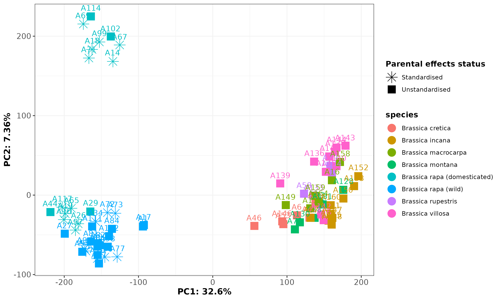

```{r setup, include=FALSE}
knitr::opts_chunk$set(echo = F, message = F, warning = F, cache = T, 
                      cache.path =  "/home/benjamin/Documents/Brassicas_repo/Brassicas_cache/Cache")
knitr::opts_knit$set(root.dir = "/home/benjamin/Documents/Brassicas_repo")
setwd("/home/benjamin/Documents/Brassicas_repo")
```
```{r load-rnaseq-libraries-and-functions, eval = TRUE, echo = FALSE, include = FALSE}
# get libraries
basic_libraries = c("DESeq2",
                    "tidyverse",
                    "WGCNA",
                    "RColorBrewer",
                    "topGO",
                    "rrvgo",
                    "GOSemSim",
                    "org.Dm.eg.db")
for(lib in basic_libraries){
  if(require(package = lib, character.only = TRUE)){
    print("Successful")
  }else{print("Installing")
    install.packages(lib, Ncpus = 6)
    library(lib, character.only = TRUE)}
}
#prevent other packages overriding dplyr's select
select = dplyr::select
#import custom functions
source("Functions/expression_heatmap.R")
source("Functions/topGO_wrapper.R")
source("Functions/gene_overlap_test.R")
source("Functions/GO_treeplots.R")
```

## Data import, pre-filtering and QC

```{r import-rnaseq-data, eval = TRUE, echo = FALSE, include = FALSE}
#import GO mapping
load("Data/GO/raph_GOmapping.Rdata")
#pull relevant metadata
data.meta = read.csv("/home/benjamin/Documents/Brassicas_repo/Data/RNAseq/RNASeq_sample_info.csv") %>%
  #rename variable levels for consistency
  mutate(Domesticated = ifelse(Wild..Domesticated=="Wild","Wild","Cultivated")) %>%
  mutate(Environment = ifelse(Environment=="wheat competition","Wheat","Control"),
         Parental.effects.status = ifelse(Parental.effects.status == "'\"standardised\"","Standardised","Unstandardised")) %>%
  #drop unused variables
  dplyr::select(c("RNAseq.sample.name","Species","Label","Parental.effects.status","Environment","Domesticated","Generation")) %>%
  #rename variables for consistency
  'colnames<-'(c("sample","species","label","parental.effects","treatment","domesticated","generation")) %>%
  #convert all variables to factor
  mutate_all(as.factor) %>%
  #relevel variables of interest so that the 'natural' state (wild+wheat) is always the base level
  mutate(treatment = fct_relevel(treatment, c("Wheat","Control")),
         domesticated = fct_relevel(domesticated, c("Wild","Cultivated")))
#subset by genus
metadata.brass = subset(data.meta, substr(species,1,3)=="Bra")
metadata.raph = subset(data.meta, substr(species,1,3)=="Rap")

#fix an apparent typo in raphanus metadata
metadata.raph$species[which(metadata.raph$species=="Raphanus raphanistrum mungra")] = "Raphanus raphanistrum munra"

#import rnaseq data
brass.gene.counts = read.csv("/home/benjamin/Documents/Brassicas_repo/Data/RNAseq/brapa.gene.counts.csv", row.names = 1)
raph.gene.counts = read.csv("/home/benjamin/Documents/Brassicas_repo/Data/RNAseq/raph.gene.counts.csv", row.names = 1)
#import GO mapping
load("Data/GO/brass_GOmapping.Rdata")
load("Data/GO/raph_GOmapping.Rdata")

#choose whether to keep or exclude unusual samples
dropWeirds = FALSE
```

We begin by performing QC on the RNAseq data, removing genes with low expression and samples that have evidence of being mislabeled. First for Brassica:

```{r qc-brassica, eval = TRUE, echo = FALSE, include = TRUE}
#filter by expression
brass.gene.counts.clean = brass.gene.counts[(which(rowMeans(brass.gene.counts)>=1)),]
print(paste0(nrow(brass.gene.counts)-nrow(brass.gene.counts.clean),"/",nrow(brass.gene.counts)," Brassica genes filtered due to very low expression."))
#an additional filter- remove genes that have too many 0 counts
print(paste0("Removing an additional ",nrow(brass.gene.counts.clean[rowSums(brass.gene.counts.clean >= 5) < 3,])," Brassica genes with many low counts."))
brass.gene.counts.clean = brass.gene.counts.clean[rowSums(brass.gene.counts.clean >= 5) >= 3,]
#check that metadata and count matrices conform
#table(metadata.brass$sample %in% colnames(brass.gene.counts.clean))
brass.gene.counts.clean = brass.gene.counts.clean[,as.character(metadata.brass$sample)]
# log-transform with a pseudocount for PCA
pca.counts = log2(brass.gene.counts.clean+1)
#create pca object
data.pca = prcomp(t(pca.counts))
#extract PC data
percent.var = (data.pca$sdev^2 / sum(data.pca$sdev^2))
pca.out = list(values = data.frame(data.pca$x),
               percent.var = percent.var)
#connect to phenotypic data
ggpcadata = pca.out$values %>%
  rownames_to_column(var = "sample") %>%
  left_join(metadata.brass,
            by = "sample")
#plot but with species labels
brass.pca = ggplot(ggpcadata, aes(x = PC1, y = PC2, shape = domesticated, color = species, label = sample)) +
  geom_point(size = 5, position = position_jitter(width = 0.5,height=0.5)) +
  geom_text(vjust = -1) +
  xlab(paste0("PC",1,": ",signif(pca.out$percent.var[1]*100, 3),"%")) +
  ylab(paste0("PC",2,": ",signif(pca.out$percent.var[2]*100, 3),"%")) +
  theme_bw() +
  # scale_color_manual(name = "Treatment",
  #                    values = brewer.pal(7, "Paired")) +
  scale_shape_manual(name = "Treatment",
                     values = c(8,15:20)) +
  theme(panel.grid = element_line(color = "grey95"),
        legend.title = element_text(face = "bold"),
        axis.text.x = element_text(size = 11),
        axis.text.y = element_text(size = 11),
        axis.title = element_text(face = "bold", size =12))
#from this we can see that the big clstering is rapa vs others. For simplicity, let's consider dropping the 'weird' samples,
#and also their 'partners' where relevant
checkframe = read.csv("Data/RNAseq/RNASeq_sample_info.csv")
checksample = substr(subset(checkframe, RNAseq.sample.name == "A31")$Label,1,11)
brassica.outliers = subset(checkframe, substr(Label,1,11) == checksample)$RNAseq.sample.name %>%
  c("A112","A108","A86","A129")
metadata.brass.clean= subset(metadata.brass, !(sample %in% brassica.outliers))
brass.gene.counts.clean = brass.gene.counts.clean[,as.character(metadata.brass.clean$sample)]
#based on the phylogeny, we also need to drop brassica rapa spp. rapa
bad.rapas = subset(checkframe,substr(Variety.population,1,9)=="ssp. rapa")$RNAseq.sample.name
metadata.brass.clean= subset(metadata.brass.clean, !(sample %in% bad.rapas))
brass.gene.counts.clean = brass.gene.counts.clean[,as.character(metadata.brass.clean$sample)]
#several other samples place strangely in the phylogeny, so drop these as well
phylogeny.drop = c("BCR-WP2",
                   "BCR-WP3",
                   "BIC-WP6",
                   "BMO-WP1",
                   "BMO-WP2")
misplaced.brassicas = subset(checkframe, substr(Label,5,11)%in%phylogeny.drop)$RNAseq.sample.name
metadata.brass.clean= subset(metadata.brass.clean, !(sample %in% misplaced.brassicas))
brass.gene.counts.clean = brass.gene.counts.clean[,as.character(metadata.brass.clean$sample)]

#re-run PCA now that outliers have been excluded
# log-transform with a pseudocount
pca.counts = log2(brass.gene.counts.clean+1)
#create pca object
data.pca = prcomp(t(pca.counts))
#extract PC data
percent.var = (data.pca$sdev^2 / sum(data.pca$sdev^2))
pca.out = list(values = data.frame(data.pca$x),
               percent.var = percent.var)
#connect to phenotypic data
ggpcadata = pca.out$values %>%
  rownames_to_column(var = "sample") %>%
  left_join(metadata.brass.clean,
            by = "sample")
#relabel species for plotting
ggpcadata$species = as.character(ggpcadata$species)
ggpcadata$species[which(ggpcadata$species=="Brassica rapa" & ggpcadata$domesticated=="Cultivated")] = "Brassica rapa (domesticated)"
ggpcadata$species[which(ggpcadata$species=="Brassica rapa" & ggpcadata$domesticated=="Wild")] = "Brassica rapa (wild)"
#plot with species labels
brass.clean.pca = ggplot(ggpcadata, aes(x = PC1, y = PC2, shape = parental.effects, color = species, label = sample)) +
  geom_point(size = 5, position = position_jitter(width = 0.5,height = 0.5)) +
  geom_text(vjust = -1) +
  xlab(paste0("PC",1,": ",signif(pca.out$percent.var[1]*100, 3),"%")) +
  ylab(paste0("PC",2,": ",signif(pca.out$percent.var[2]*100, 3),"%")) +
  theme_bw() +
  # scale_color_manual(name = "Treatment",
  #                    values = brewer.pal(7, "Paired")) +
  scale_shape_manual(name = "Parental effects status",
                     values = c(8,15:20)) +
  theme(panel.grid = element_line(color = "grey95"),
        legend.title = element_text(face = "bold"),
        axis.text.x = element_text(size = 11),
        axis.text.y = element_text(size = 11),
        axis.title = element_text(face = "bold", size = 12))
#save plot
ggsave(brass.clean.pca, 
       filename = "brass_clean_pca.png",
       device = "png", path = "Analysis/RNAseq/Images/",
       width =  25, height = 15, units = "cm")
```
Looking at the PCA, we can see a strange cluster of outlying Brassicas. These are all B. rapa tricoloris; we won't exclude them, but we'll take a note of their labels in case we want to try re-running analyses without them later. 
```{r qc-tricoloris}
#the brapa samples clearly divide into two very distinct groups along the second PC
outgroup = subset(ggpcadata, PC1<(-100) & PC2>(100))$sample
outcheck= subset(checkframe, RNAseq.sample.name %in% outgroup)
#okay, the 'outliers' comprise all and only the tricoloris samples. Mark says this is fine! 
#But record for later, in case we want to try running with and without
tricoloris.outsamples = subset(checkframe, RNAseq.sample.name %in% outgroup)$RNAseq.sample.name
#plot PCA for markdown

#drop weird samples if user has specified to do so
if(dropWeirds){
  metadata.brass.clean = subset(metadata.brass.clean,!(sample%in%tricoloris.outsamples))
  brass.gene.counts.clean = select(brass.gene.counts.clean,metadata.brass.clean$sample)
  }
```

Now repeat QC and pre-filtering for Raphanus samples:

```{r qc-raphanus}
#filter by expression, removing genes with <1 count/sample
raph.gene.counts.clean = raph.gene.counts[(which(rowMeans(raph.gene.counts)>=1)),]
paste0(nrow(raph.gene.counts)-nrow(raph.gene.counts.clean),"/",nrow(raph.gene.counts)," Raphanus genes filtered due to very low expression.")
#an additional filter- remove genes that only have expression in a couple of samples
paste0("Removing an additional ",nrow(raph.gene.counts.clean[rowSums(raph.gene.counts.clean >= 5) < 3,])," genes with many low counts.")
raph.gene.counts.clean = raph.gene.counts.clean[rowSums(raph.gene.counts.clean >= 5) >= 3,]
#check that metadata and count matrices conform
#table(metadata.raph$sample %in% colnames(raph.gene.counts.clean))
raph.gene.counts.clean = raph.gene.counts.clean[,as.character(metadata.raph$sample)]

# log-transform with a pseudocount for PCA
pca.counts = log2(raph.gene.counts.clean+1)
#create pca object
data.pca = prcomp(t(pca.counts))
#extract PC data
percent.var = (data.pca$sdev^2 / sum(data.pca$sdev^2))
pca.out = list(values = data.frame(data.pca$x),
               percent.var = percent.var)
#connect to phenotypic data
ggpcadata = pca.out$values %>%
  rownames_to_column(var = "sample") %>%
  left_join(metadata.raph,
            by = "sample")
#plot
raph.clean.pca = ggplot(ggpcadata, aes(x = PC1, y = PC2, color = species, shape = parental.effects, label = sample)) +
  geom_point(size = 5, position = position_jitter(width = 0.5,height=0.5)) +
  #geom_text(vjust = -1) +
  xlab(paste0("PC",1,": ",signif(pca.out$percent.var[1]*100, 3),"%")) +
  ylab(paste0("PC",2,": ",signif(pca.out$percent.var[2]*100, 3),"%")) +
  theme_bw() +
  # scale_color_manual(name = "Treatment",
  #                    values = brewer.pal(7, "Paired")) +
  scale_shape_manual(name = "Parental effects status",
                     values = c(8,15:20)) +
  theme(panel.grid = element_line(color = "grey95"),
        legend.title = element_text(face = "bold"),
        axis.text.x = element_text(size = 11),
        axis.text.y = element_text(size = 11),
        axis.title = element_text(face = "bold", size =12))
#save plot
ggsave(raph.clean.pca, 
       filename = "raph_clean_pca.png",
       device = "png", path = "Analysis/RNAseq/Images/",
       width =  25, height = 15, units = "cm")
```
We see unusual clustering in the PCA for Raphanus, as with Brassica. The 'outlying' samples on PC2 are represent all Asian sativus var. caudatus, while the U.S. caudatus samples cluster with the other wilds. As with the unusual B. tricoloris samples, we'll retain these for now but make a note in case we wish to exclude them at a later time. 
```{r}
#check samples that look unusual
checkframe = read.csv("/home/benjamin/Documents/Brassicas_repo/Data/RNAseq/RNASeq_sample_info.csv") 
#subset(checkframe , Label %in% subset(ggpcadata,PC2<(-100))$label)
#subset(checkframe , Label %in% subset(ggpcadata,PC2>(-100) & species=="Raphanus sativus var. caudatus")$label)
outgroup = subset(ggpcadata,PC2<(-100))$label
caudatus.outsamples = subset(checkframe, Label %in% outgroup)$RNAseq.sample.name
knitr::include_graphics("Analysis/RNAseq/Images/raph_clean_pca.png")
#drop weird samples if user has specified to do so
if(dropWeirds){
  metadata.raph = subset(metadata.raph,!(sample%in%caudatus.outsamples))
  raph.gene.counts.clean = select(raph.gene.counts.clean,metadata.raph$sample)
  }
```

## Parental effect handling

Before we proceed with the analysis, we need to decide how to handle the fact that a subset of samples have been standardised for parental effects, while the remaining samples have not received such a standardisation. Checking how many genes exhibit a difference between standardised and un-standardised conditions under liberal conditions (p<0.1, lfc threshold=0) will give us some indication of how important this standardisation is. 

Note that for Raphanus, all species/subspecies have both standardised and unstandardised samples, so we can just compare all against all, whereas for Brassica standardisation is present only for some B rapa (both wild and domesticated) so we need to subset before running the DESeq2 comparison. 


```{r parental-effects-brassica}
#since parental effects are only available for brapa, we have to make sure we don't include other species
dds.parental = DESeqDataSetFromMatrix(countData = brass.gene.counts.clean[,as.character(subset(metadata.brass.clean,
                                                                                               (species == "Brassica rapa"))$sample)],
                                      colData = subset(metadata.brass.clean, species == "Brassica rapa"),
                                      design = as.formula(~parental.effects))
dds.parental.deg = DESeq(dds.parental, fitType = "parametric", betaPrior = FALSE) # we know from experience this is usually better than a local fit
brass.parental.degs = results(dds.parental.deg)
brass.parental.degs.ids = rownames(subset(brass.parental.degs, padj<=0.1))
#also check for parental deg GO terms
GOscores.parental.brass = as.numeric(row.names(brass.gene.counts.clean)%in%brass.parental.degs.ids) %>% 'names<-'(row.names(brass.gene.counts.clean))
parentGO.brass = topGO_wrapper(geneScores = GOscores.parental.brass,
                               geneScoresDE = F,
                               geneScoresDirection = NA,
                               GOmapping = GOmapping.brass,
                               algorithm = "weight01",
                               statistic = "fisher",
                               nodeSize = 10,
                               discretisedDE = F,
                               p = 0.05)
print(paste0("Number of Brassica rapa genes with parental effects at p<0.1: ",length(brass.parental.degs.ids),"/",nrow(brass.parental.degs)))
print(paste0("Number of GO terms enriched among Brassica rapa parental DEGs: ",nrow(parentGO.brass$consolidated_result)))
write.csv(parentGO.brass$consolidated_result, file = "Analysis/RNAseq/Tables/brassica_GO_parental.csv", row.names = F)
```

```{r parental-effects-raphanus}
dds.parental = DESeqDataSetFromMatrix(countData = raph.gene.counts.clean,
                                      colData = metadata.raph,
                                      design = as.formula(~parental.effects))
dds.parental.deg = DESeq(dds.parental, fitType = "parametric", betaPrior = FALSE) # we know from experience this is usually better than a local fit
raph.parental.degs = results(dds.parental.deg)
raph.parental.degs.ids = rownames(subset(raph.parental.degs, padj<=0.1))
#also check for parental deg GO terms
GOscores.parental.raph = as.numeric(row.names(raph.gene.counts.clean)%in%raph.parental.degs.ids) %>% 'names<-'(row.names(raph.gene.counts.clean))
parentGO.raph = topGO_wrapper(geneScores = GOscores.parental.raph,
                               geneScoresDE = F,
                               geneScoresDirection = NA,
                               GOmapping = GOmapping.raph,
                               algorithm = "weight01",
                               statistic = "fisher",
                               nodeSize = 10,
                               discretisedDE = F,
                               p = 0.05)
print(paste0("Number of Raphanus genes with parental effects at p<0.1: ",length(raph.parental.degs.ids),"/",nrow(raph.parental.degs)))
print(paste0("Number of GO terms enriched among Raphanus parental DEGs: ",nrow(parentGO.raph$consolidated_result)))
write.csv(parentGO.raph$consolidated_result, file = "Analysis/RNAseq/Tables/raphanus_GO_parental.csv", row.names = F)
```
Just out of interest, we'd also like to know whether the fucntions associated with parental effects in each case are the same- in fact, there's no overlap:
```{r parental-go-overlap}
allGO = intersect(unlist(GOmapping.brass),unlist(GOmapping.raph))
parentGO.overlap = gene_overlap_test(parentGO.brass,parentGO.raph, allGO, verbose=F)
print(paste0("Number of shared GO terms enriched among parental effect DEGs in Brassica and Raphanus: ",
             parentGO.overlap$intersect," (hypergeometric p=",parentGO.overlap$hypergeom,")."))
```
The number of genes that display parental effeects in each case is quite small. At this stage we could choose to exclude these genes entirely, or we could retain them but keep tabs as we go along to see if these genes overlap strongly with other sets of genes that we pull out as interesting. To be safe, we'll simply drop these genes.
```{r parental-deg-filtering}
#filter out genes with parental effects
brass.gene.counts.clean = brass.gene.counts.clean[!(row.names(brass.gene.counts.clean)%in%brass.parental.degs.ids),]
raph.gene.counts.clean = raph.gene.counts.clean[!(row.names(raph.gene.counts.clean)%in%raph.parental.degs.ids),]
```


## Work package 1: Comparing domesticates to their wild progenitors

For this work package, we wish to compare wild progenitor species to modern domesticates. For Brassica, the comparison is between domesticated B rapa with wild B rapa, while for Raphanus the comparison is between R raphanistrum (wild) and all other Raphanus samples, all of which appear to be domesticated. Our analytic design for DESeq2 is expression ~ domestication + treatment + domestication*treatment. 

First, let's run the model for Brassica and check that the fit looks good:

```{r deseq-domesticate-model-brassica}
#subset to remove all but b rapa and its wild ancestor
metadata.brass.subset = subset(metadata.brass.clean, species == "Brassica rapa")
brass.gene.counts.clean.subset = brass.gene.counts.clean[,as.character(metadata.brass.subset$sample)]
#check that metadata and count matrices conform
#table(metadata.brass.subset$sample %in% colnames(brass.gene.counts.clean.subset))
brass.gene.counts.clean.subset = brass.gene.counts.clean.subset[,as.character(metadata.brass.subset$sample)]

#now run model
dds.gene = DESeqDataSetFromMatrix(countData = brass.gene.counts.clean.subset,
                                  colData = metadata.brass.subset,
                                  design = as.formula(~treatment+domesticated+treatment*domesticated))

# Run the default analysis for DESeq2
#NA p-values are generated by 0 counts and outliers calculated by Cook's distance.
dds.gene.deg = DESeq(dds.gene, fitType = "local", betaPrior = FALSE)
# Check for outliers: none are apparent
print("Check for gene expression outliers")
par(mar=c(8,5,2,2))
boxplot(log10(assays(dds.gene.deg)[["cooks"]]), range=0, las=2)
boxplot(log10(assays(dds.gene.deg)[["counts"]]), range=0, las=2)

#Also plot the dispersion extimates to make sure they look fine
print("Local fit:")
plotDispEsts(dds.gene.deg)

#check effectof a parametric rather than local fit
parametric.gene.deg = DESeq(dds.gene, fitType = "parametric", betaPrior = FALSE)
print("Parametric fit")
plotDispEsts(parametric.gene.deg) 
# parametric seems to follow the data a little better so let's go with that
dds.gene.deg.brass = parametric.gene.deg

#save for later
save(dds.gene.deg.brass, file = "Analysis/RNAseq/Tables/brassica_rapa_deseq.R")
```

There are no apparent gene expression outliers. The parametric model is smoother and levels off more soundly to the right of the x axis, so we'll move forward using this model for the results (remember, in general it's better to overestimate than underestimate the dispersion parameter for genes with low expression). 

Now the results for Brassica:

```{r deseq-domesticate-results-brassica-treatment}
#results: wheat vs control
degs.brass.treatment = results(dds.gene.deg.brass, 
                              name="treatment_Control_vs_Wheat",     
                              alpha = 0.05,
                              lfcThreshold = log2(1))
degs.brass.treatment.Nup = nrow(subset(degs.brass.treatment, padj<=0.05 & log2FoldChange>0)) #9 up in control
degs.brass.treatment.Ndown = nrow(subset(degs.brass.treatment, padj<=0.05 & log2FoldChange<0)) #16 up in wheat
degs.brass.treatment.ids = rownames(subset(degs.brass.treatment, padj<=0.05))

#1 of these degs shared with parental degs
#table(degs.brass.treatment.ids%in%parental.degs.ids)
#also check for  GO terms 
brass.treatment.GO.up = topGO_wrapper(geneScores = degs.brass.treatment,
                                     geneScoresDE = T,
                                     geneScoresDirection = "Up",
                                     GOmapping = GOmapping.brass,
                                     algorithm = "weight01",
                                     statistic = "fisher",
                                     nodeSize = 10,
                                     discretisedDE = T,
                                     p = 0.05)
write.csv(brass.treatment.GO.up$consolidated_result, 
          file = "Analysis/RNAseq/Tables/brapas_GO_controlbias.csv", row.names = FALSE)
#15 GO terms up
brass.treatment.GO.down = topGO_wrapper(geneScores = degs.brass.treatment,
                                       geneScoresDE = T,
                                       geneScoresDirection = "Down",
                                       GOmapping = GOmapping.brass,
                                       algorithm = "weight01",
                                       statistic = "fisher",
                                       nodeSize = 10,
                                       discretisedDE = T,
                                       p = 0.05)
write.csv(brass.treatment.GO.down$consolidated_result, 
          file = "Analysis/RNAseq/Tables/brapas_GO_wheatbias.csv", row.names = FALSE)
#13 GO terms down
```
```{r deseq-domesticate-results-brassica-domestication}
#results: cultivated vs wild
degs.brass.cultivated = results(dds.gene.deg.brass, 
                               name="domesticated_Cultivated_vs_Wild",     
                               alpha = 0.05,
                               lfcThreshold = log2(1))
#summary(degs.brass.cultivated) #~2000 degs
degs.brass.cultivated.Nup = nrow(subset(degs.brass.cultivated, padj<=0.05 & log2FoldChange>0)) #2073 up in cultivar
degs.brass.cultivated.Ndown = nrow(subset(degs.brass.cultivated, padj<=0.05 & log2FoldChange<0)) #1818 up in wild
degs.brass.cultivated.ids = rownames(subset(degs.brass.cultivated, padj<=0.05))
#80 of these degs are shared with parental degs
#table(degs.brass.cultivated.ids%in%parental.degs.ids)
#also check for deg GO terms 
brass.cultivated.GO.up = topGO_wrapper(geneScores = degs.brass.cultivated,
                                      geneScoresDE = T,
                                      geneScoresDirection = "Up",
                                      GOmapping = GOmapping.brass,
                                      algorithm = "weight01",
                                      statistic = "fisher",
                                      nodeSize = 10,
                                      discretisedDE = T,
                                      p = 0.05)
write.csv(brass.cultivated.GO.up$consolidated_result, 
          file = "Analysis/RNAseq/Tables/brapas_GO_cultivatedbias.csv", row.names = FALSE)
#15 GO terms up
brass.cultivated.GO.down = topGO_wrapper(geneScores = degs.brass.cultivated,
                                        geneScoresDE = T,
                                        geneScoresDirection = "Down",
                                        GOmapping = GOmapping.brass,
                                        algorithm = "weight01",
                                        statistic = "fisher",
                                        nodeSize = 10,
                                        discretisedDE = T,
                                        p = 0.05)
write.csv(brass.treatment.GO.down$consolidated_result, 
          file = "Analysis/RNAseq/Tables/brapas_GO_wildbias.csv", row.names = FALSE)
#13 GO terms down
```
```{r deseq-domesticate-results-brassica-interaction}
#results: interaction
degs.brass.interaction = results(dds.gene.deg.brass, 
                                name="treatmentControl.domesticatedCultivated",     
                                alpha = 0.05,
                                lfcThreshold = log2(1))
#summary(degs.brass.interaction) #43 degs
degs.brass.interaction.ids = rownames(subset(degs.brass.interaction, padj<=0.05))
degs.brass.interaction.N = length(degs.brass.interaction.ids)
#none of these degs are shared with parental degs
#table(degs.brass.interaction.ids%in%parental.degs.ids)
#also check for parental deg GO terms 
brass.interaction.GO = topGO_wrapper(geneScores = degs.brass.interaction,
                                    geneScoresDE = T,
                                    geneScoresDirection = NA,
                                    GOmapping = GOmapping.brass,
                                    algorithm = "weight01",
                                    statistic = "fisher",
                                    nodeSize = 10,
                                    discretisedDE = T,
                                    p = 0.05)
#brass.interaction.GO$consolidated_result
#25 GO terms

#save GO output plot
GO_treeplots(brass.interaction.GO,
             path = "Analysis/RNAseq/Images/brassica_domesticate_vs_progenitor_GO_treeplot.png")
```

```{r deseq-domesticate-results-brassica-print}
print(paste0("Genes DE with treatment in Brassica rapa: ",degs.brass.treatment.Nup," upregulated in no-competition treatment; ",
             degs.brass.treatment.Ndown, " upregulated in competition treatment."))

print(paste0("Genes DE with domestication status in Brassica rapa: ",degs.brass.cultivated.Nup," upregulated in domesticated samples; ",
             degs.brass.cultivated.Ndown, " upregulated in wild samples."))

print(paste0("Genes DE with interaction between treatment and domestication in Brassica rapa: ",degs.brass.interaction.N,"."))
 
#record outputs for conversion to table and print
numdegs = c(degs.brass.cultivated.Nup, degs.brass.cultivated.Ndown, 
            degs.brass.treatment.Nup, degs.brass.treatment.Ndown, degs.brass.interaction.N)
numGO = c(nrow(brass.cultivated.GO.up$consolidated_result), nrow(brass.cultivated.GO.down$consolidated_result),
          nrow(brass.treatment.GO.up$consolidated_result), nrow(brass.treatment.GO.down$consolidated_result),
          nrow(brass.interaction.GO$consolidated_result))
brass.output = data.frame(DEGs=numdegs, GO_terms=numGO, 
                                         row.names = c("Domesticated_bias","Wild_bias","Unstressed_bias","Stressed_bias","Interaction"))
brass.output
if(dropWeirds){
  write.csv(brass.output, file = "Analysis/RNAseq/Tables/brassica_deseq_domesticate_vs_progenitor_summary_exclude_weird_tricoloris.csv")
}else{
  write.csv(brass.output, file = "Analysis/RNAseq/Tables/brassica_deseq_domesticate_vs_progenitor_summary.csv")
}
```

We're particularly interested in the interaction DEGs, since these are genes that, under domestication, have expressed a change in the plasticity of their responses to a cultivated (i.e. no-competition) environment. Interaction terms are hard to interpret, but plotting helps. Here's the 12 most significant interaction terms:

```{r deseq-domesticate-results-brassica-interactionplots}
#for the interaction terms, we also plot the output to understand what exactly is going on
#get the 12 terms with lowest adjusted p value
degs.brass.interaction.signif = subset(degs.brass.interaction, padj<0.05)
interestgenes = row.names(degs.brass.interaction.signif)[order(degs.brass.interaction.signif$log2FoldChange,decreasing = T)[1:12]]
#for each gene, extract the counts for plotting and label by gene
for(i in 1:length(interestgenes)){
  #if first element, instantiate frame, otherwise rbind to frame
  if(i==1) {
    brass.intplotdata = plotCounts(dds.gene.deg, gene=interestgenes[i], intgroup=c("domesticated","treatment"), returnData = T)
    brass.intplotdata$gene = interestgenes[i]
  } else {
    addrows = data.frame(plotCounts(dds.gene.deg, gene=interestgenes[i], intgroup=c("domesticated","treatment"), returnData = T), 
                         gene = interestgenes[i])
    brass.intplotdata = rbind(brass.intplotdata, addrows)
  }
}

#plot with ggplot facet wrap
brass.intplot= ggplot(brass.intplotdata, aes(x = treatment, y = count)) +
  stat_summary(aes(group = domesticated), fun = mean, geom = "path") +
  stat_summary(aes(color = domesticated), fun.data = mean_cl_boot, geom = "errorbar", width = 0.1) +
  stat_summary(aes(color = domesticated), fun = mean, geom = "point", size = 4) +
  geom_point(aes(color = domesticated), size = 2) +
  scale_color_manual(values = brewer.pal(6,"Set3")[c(5,6)]) +
  facet_wrap(~gene, scales = "free")
brass.intplot
#save plot
ggsave(brass.intplot, 
       filename = "brapas_interaction_deg_plots.png",
       device = "png", path = "Analysis/RNAseq/Images/",
       width =  40, height = 25, units = "cm")
```

There doesn't appear to be an overall trend in terms of gains or losses of plasticity, but we can check this by asking whether the fold changes on average are higher or lower for wild or domesticated samples:

```{r brassica-plasticity-analysis}
#set dplyr options to avoid excessively verbose output
options(dplyr.summarise.inform=F)
#loop across interaction genes, checking whether plasticity is higher in wild or domesticated
for(i in 1:length(degs.brass.interaction.ids)){
  #for each gene, summarise count values by domestication and treatment
  intgene.data = plotCounts(dds.gene.deg, gene=degs.brass.interaction.ids[i], intgroup=c("domesticated","treatment"), returnData = T)
  intgene.counts = intgene.data %>% group_by(domesticated,treatment) %>% 
    summarise(mean = mean(count))
  #get absolute difference in count means
  intgene.diff.frame = data.frame(gene = degs.brass.interaction.ids[i],
                                   wild = abs(diff(subset(intgene.counts,domesticated == "Wild")$mean)),
                                   dom = abs(diff(subset(intgene.counts,domesticated == "Cultivated")$mean)))
  #check whether absolute difference in count means is higher for wild or for cultivated
  intgene.diff.frame = mutate(intgene.diff.frame, wild.higher = (wild>dom))
  #collate output
  if(i==1){intgene.diff.out = intgene.diff.frame}else{intgene.diff.out = rbind(intgene.diff.out,intgene.diff.frame)}
}

#run a chisq test here checking whether higher wild or dom is statistically overrepresented
table(intgene.diff.out$wild.higher)
brass.inter.chisq = chisq.test(table(intgene.diff.out$wild.higher))
#run a paired t-test comparing fold changes in wild or domesticated
brass.inter.t.test = t.test(intgene.diff.out$wild,intgene.diff.out$dom,paired=T)
brass.inter.wilcox = wilcox.test(intgene.diff.out$wild,intgene.diff.out$dom,paired=T)


print("Probability that changes in plasticity of Brassica genes during domestication are non-random in their directionality:") 
print(paste0("chi-squared p=",signif(brass.inter.chisq$p.value,3),"; paired t-test p=",signif(brass.inter.t.test$p.value,3)))
#save for later
write.csv(intgene.diff.out,file = "Analysis/RNAseq/brassica_interaction_gene_directionality_table.csv")
save(brass.inter.t.test,file = "Analysis/RNAseq/brassica_interaction_gene_directionality_ttest.R")
save(brass.inter.chisq,file = "Analysis/RNAseq/brassica_interaction_gene_directionality_chisq.R")
save(brass.inter.wilcox,file = "Analysis/RNAseq/brassica_interaction_gene_directionality_wilcox.R")
```

Try this analysis again, but subset between the Brassica subspecies (tricoloris vs others)

```{r brassica-plasticity-analysis-per-domesticated-subspecies}
#domesticates are either tricoloris or chinensis 
tricolouris = subset(checkframe,substr(Variety.population,7,17)=="tricolouris")$RNAseq.sample.name
chinensis = subset(checkframe,substr(Variety.population,6,14)=="chinensis")$RNAseq.sample.name
wildRapas = as.character(subset(metadata.brass.subset,domesticated=="Wild")$sample)

brass.domesticates = c("tricolouris","chinensis")

#loop, subsetting intgene.data to use only accessions from one domesticate at a time
for(j in 1:length(brass.domesticates)){
  #note species
  focaldom = as.character(brass.domesticates[j])
  for(i in 1:length(degs.brass.interaction.ids)){
    #for gene, get count values by domestication and treatment
    intgene.data = plotCounts(dds.gene.deg, gene=degs.brass.interaction.ids[i], intgroup=c("domesticated","treatment"), returnData = T)
    #subset to only samples in wild and focal domesticate
    comparesamples = c(wildRapas,get(focaldom))
    intgene.data.focal = intgene.data[comparesamples,]
    intgene.counts.focal = intgene.data.focal %>% group_by(domesticated,treatment) %>% 
      summarise(mean = mean(count))
    #get absolute difference in count means
    intgene.diff.frame = data.frame(gene = degs.brass.interaction.ids[i],
                                    wild = abs(diff(subset(intgene.counts.focal,domesticated == "Wild")$mean)),
                                    dom = abs(diff(subset(intgene.counts.focal,domesticated == "Cultivated")$mean)))
    #check whether absolute difference in count means is higher for wild or for cultivated
    intgene.diff.frame = mutate(intgene.diff.frame, wild.higher = (wild>dom))
    #collate output
    if(i==1){intgene.diff.out = intgene.diff.frame}else{intgene.diff.out = rbind(intgene.diff.out,intgene.diff.frame)}
  }

  #run a chisq test here checking whether higher wild or dom is statistically overrepresented
  brass.inter.table = table(intgene.diff.out$wild.higher)
  brass.inter.chisq = chisq.test(table(intgene.diff.out$wild.higher))
  #run a paired t-test comparing fold changes in wild or domesticated
  brass.inter.t.test = t.test(intgene.diff.out$wild,intgene.diff.out$dom,paired=T)
  brass.inter.wilcox.test = wilcox.test(intgene.diff.out$wild,intgene.diff.out$dom,paired=T)
  #collate statistics for this species
  brass.inter.results =   data.frame(species = brass.domesticates[j],up_wild = brass.inter.table[2], up_dom = brass.inter.table[1], 
                                    chisq = signif(brass.inter.chisq$p.value,3), t = signif(brass.inter.t.test$p.value,3),
                                    wilcox = brass.inter.wilcox.test$p.value)
  #collate output
  if(j==1){brass.inter.out = brass.inter.results} else {brass.inter.out = rbind(brass.inter.out,brass.inter.results)}
}
#print
brass.inter.out %>% remove_rownames()
write.csv(brass.inter.out, file = "Analysis/RNAseq/Tables/brassica_interaction_gene_directionality_perspecies_summary.csv", row.names = F)
```

This is interesting: when we subset by the domesticated subspecies, we do get significant results for at least some of the statistical tests: it seems that wild rapa is more plastic than tricolouris, but may be less plastic than chinensis. 


Now, let's repeat the above analyses using Raphanus. First check that the fit looks good:

```{r deseq-domesticate-model-raphanus}
#run model
dds.gene = DESeqDataSetFromMatrix(countData = raph.gene.counts.clean,
                                  colData = metadata.raph,
                                  design = as.formula(~treatment+domesticated+treatment*domesticated))

# Run the default analysis for DESeq2
#NA p-values are generated by 0 counts and outliers calculated by Cook's distance.
dds.gene.deg = DESeq(dds.gene, fitType = "local", betaPrior = FALSE)
# Check for outliers: none are apparent
print("Check for gene expression outliers")
par(mar=c(8,5,2,2))
boxplot(log10(assays(dds.gene.deg)[["cooks"]]), range=0, las=2)
boxplot(log10(assays(dds.gene.deg)[["counts"]]), range=0, las=2)

#Also plot the dispersion extimates to make sure they look fine
print("Local fit:")
plotDispEsts(dds.gene.deg)

#check effectof a parametric rather than local fit
parametric.gene.deg = DESeq(dds.gene, fitType = "parametric", betaPrior = FALSE)
print("Parametric fit")
plotDispEsts(parametric.gene.deg) 
# parametric seems to follow the data a little better so let's go with that
dds.gene.deg.raph = parametric.gene.deg

#save for later
save(dds.gene.deg.raph, file = "Analysis/RNAseq/Tables/raphanus_deseq.R")
```

There are no apparent gene expression outliers. The parametric model is smoother and levels off more soundly to the right of the x axis, so we'll move forward using this model for the results (remember, in general it's better to overestimate than underestimate the dispersion parameter for genes with low expression). 

```{r deseq-domesticate-results-raphanus-treatment}
#results: wheat vs control
degs.raph.treatment = results(dds.gene.deg.raph, 
                              name="treatment_Control_vs_Wheat",     
                              alpha = 0.05,
                              lfcThreshold = log2(1))
degs.raph.treatment.Nup = nrow(subset(degs.raph.treatment, padj<=0.05 & log2FoldChange>0)) #9 up in control
degs.raph.treatment.Ndown = nrow(subset(degs.raph.treatment, padj<=0.05 & log2FoldChange<0)) #16 up in wheat
degs.raph.treatment.ids = rownames(subset(degs.raph.treatment, padj<=0.05))

#1 of these degs shared with parental degs
#table(degs.raph.treatment.ids%in%parental.degs.ids)
#also check for  GO terms 
raph.treatment.GO.up = topGO_wrapper(geneScores = degs.raph.treatment,
                                     geneScoresDE = T,
                                     geneScoresDirection = "Up",
                                     GOmapping = GOmapping.raph,
                                     algorithm = "weight01",
                                     statistic = "fisher",
                                     nodeSize = 10,
                                     discretisedDE = T,
                                     p = 0.05)
write.csv(raph.treatment.GO.up$consolidated_result, 
          file = "Analysis/RNAseq/Tables/brapas_GO_controlbias.csv", row.names = FALSE)
#15 GO terms up
raph.treatment.GO.down = topGO_wrapper(geneScores = degs.raph.treatment,
                                       geneScoresDE = T,
                                       geneScoresDirection = "Down",
                                       GOmapping = GOmapping.raph,
                                       algorithm = "weight01",
                                       statistic = "fisher",
                                       nodeSize = 10,
                                       discretisedDE = T,
                                       p = 0.05)
write.csv(raph.treatment.GO.down$consolidated_result, 
          file = "Analysis/RNAseq/Tables/brapas_GO_wheatbias.csv", row.names = FALSE)
#13 GO terms down
```
```{r deseq-domesticate-results-raphanus-domestication}
#results: cultivated vs wild
degs.raph.cultivated = results(dds.gene.deg.raph, 
                               name="domesticated_Cultivated_vs_Wild",     
                               alpha = 0.05,
                               lfcThreshold = log2(1))
#summary(degs.raph.cultivated) #~2000 degs
degs.raph.cultivated.Nup = nrow(subset(degs.raph.cultivated, padj<=0.05 & log2FoldChange>0)) #2073 up in cultivar
degs.raph.cultivated.Ndown = nrow(subset(degs.raph.cultivated, padj<=0.05 & log2FoldChange<0)) #1818 up in wild
degs.raph.cultivated.ids = rownames(subset(degs.raph.cultivated, padj<=0.05))
#80 of these degs are shared with parental degs
#table(degs.raph.cultivated.ids%in%parental.degs.ids)
#also check for deg GO terms 
raph.cultivated.GO.up = topGO_wrapper(geneScores = degs.raph.cultivated,
                                      geneScoresDE = T,
                                      geneScoresDirection = "Up",
                                      GOmapping = GOmapping.raph,
                                      algorithm = "weight01",
                                      statistic = "fisher",
                                      nodeSize = 10,
                                      discretisedDE = T,
                                      p = 0.05)
write.csv(raph.cultivated.GO.up$consolidated_result, 
          file = "Analysis/RNAseq/Tables/brapas_GO_cultivatedbias.csv", row.names = FALSE)
#15 GO terms up
raph.cultivated.GO.down = topGO_wrapper(geneScores = degs.raph.cultivated,
                                        geneScoresDE = T,
                                        geneScoresDirection = "Down",
                                        GOmapping = GOmapping.raph,
                                        algorithm = "weight01",
                                        statistic = "fisher",
                                        nodeSize = 10,
                                        discretisedDE = T,
                                        p = 0.05)
write.csv(raph.treatment.GO.down$consolidated_result, 
          file = "Analysis/RNAseq/Tables/brapas_GO_wildbias.csv", row.names = FALSE)
#13 GO terms down
```
```{r deseq-domesticate-results-raphanus-interaction}
#results: interaction
degs.raph.interaction = results(dds.gene.deg.raph, 
                                name="treatmentControl.domesticatedCultivated",     
                                alpha = 0.05,
                                lfcThreshold = log2(1))
#summary(degs.raph.interaction) #43 degs
degs.raph.interaction.ids = rownames(subset(degs.raph.interaction, padj<=0.05))
degs.raph.interaction.N = length(degs.raph.interaction.ids)
#none of these degs are shared with parental degs
#table(degs.raph.interaction.ids%in%parental.degs.ids)
#also check for parental deg GO terms 
raph.interaction.GO = topGO_wrapper(geneScores = degs.raph.interaction,
                                    geneScoresDE = T,
                                    geneScoresDirection = NA,
                                    GOmapping = GOmapping.raph,
                                    algorithm = "weight01",
                                    statistic = "fisher",
                                    nodeSize = 10,
                                    discretisedDE = T,
                                    p = 0.05)
#raph.interaction.GO$consolidated_result
#25 GO terms
GO_treeplots(raph.interaction.GO,
             path = "Analysis/RNAseq/Images/raphanus_domesticate_vs_progenitor_GO_treeplot.png")
```

```{r deseq-domesticate-results-raphanus-print}
print(paste0("Genes DE with treatment in Raphanus: ",degs.raph.treatment.Nup," upregulated in no-competition treatment; ",
             degs.raph.treatment.Ndown, " upregulated in competition treatment."))

print(paste0("Genes DE with domestication status in Raphanus: ",degs.raph.cultivated.Nup," upregulated in domesticated samples; ",
             degs.raph.cultivated.Ndown, " upregulated in wild samples."))

print(paste0("Genes DE with interaction between treatment and domestication in Raphanus: ",degs.raph.interaction.N,"."))
 
#record outputs for conversion to table and print
numdegs = c(degs.raph.cultivated.Nup, degs.raph.cultivated.Ndown, 
            degs.raph.treatment.Nup, degs.raph.treatment.Ndown, degs.raph.interaction.N)
numGO = c(nrow(raph.cultivated.GO.up$consolidated_result), nrow(raph.cultivated.GO.down$consolidated_result),
          nrow(raph.treatment.GO.up$consolidated_result), nrow(raph.treatment.GO.down$consolidated_result),
          nrow(raph.interaction.GO$consolidated_result))
raph.output = data.frame(DEGs=numdegs, GO_terms=numGO, 
                                         row.names = c("Domesticated_bias","Wild_bias","Unstressed_bias","Stressed_bias","Interaction"))
raph.output
if(dropWeirds){
  write.csv(raph.output, file = "Analysis/RNAseq/Tables/raphanus_deseq_domesticate_vs_progenitor_summary_exclude_weird_caudatus.csv")
}else{
  write.csv(raph.output, file = "Analysis/RNAseq/Tables/raphanus_deseq_domesticate_vs_progenitor_summary.csv")
  }
```

Plotting the 12 most significant interaction terms for Raphanus:

```{r deseq-domesticate-results-raphanus-interactionplots}
#for the interaction terms, we also plot the output to understand what exactly is going on
#get the 12 terms with lowest adjusted p value
degs.raph.interaction.signif = subset(degs.raph.interaction, padj<0.05)
interestgenes = row.names(degs.raph.interaction.signif)[order(degs.raph.interaction.signif$log2FoldChange,decreasing = T)[1:12]]
#for each gene, extract the counts for plotting and label by gene
for(i in 1:length(interestgenes)){
  #if first element, instantiate frame, otherwise rbind to frame
  if(i==1) {
    raph.intplotdata = plotCounts(dds.gene.deg, gene=interestgenes[i], intgroup=c("domesticated","treatment"), returnData = T)
    raph.intplotdata$gene = interestgenes[i]
  } else {
    addrows = data.frame(plotCounts(dds.gene.deg, gene=interestgenes[i], intgroup=c("domesticated","treatment"), returnData = T), 
                         gene = interestgenes[i])
    raph.intplotdata = rbind(raph.intplotdata, addrows)
  }
}

#plot with ggplot facet wrap
raph.intplot= ggplot(raph.intplotdata, aes(x = treatment, y = count)) +
  stat_summary(aes(group = domesticated), fun = mean, geom = "path") +
  stat_summary(aes(color = domesticated), fun.data = mean_cl_boot, geom = "errorbar", width = 0.1) +
  stat_summary(aes(color = domesticated), fun = mean, geom = "point", size = 4) +
  geom_point(aes(color = domesticated), size = 2) +
  scale_color_manual(values = brewer.pal(6,"Set3")[c(5,6)]) +
  facet_wrap(~gene, scales = "free")
raph.intplot
#save plot
ggsave(raph.intplot, 
       filename = "raphanus_interaction_deg_plots.png",
       device = "png", path = "Analysis/RNAseq/Images/",
       width =  40, height = 25, units = "cm")
```

Are Raphanus interaction genes statistically of greater plasticity in wild or domesticated samples?

```{r raphanus-plasticity-analysis}
#set dplyr options to avoid excessively verbose output
options(dplyr.summarise.inform=F)
#loop across interaction genes, checking whether plasticity is higher in wild or domesticated
for(i in 1:length(degs.raph.interaction.ids)){
  #for each gene, summarise count values by domestication and treatment
  intgene.data = plotCounts(dds.gene.deg, gene=degs.raph.interaction.ids[i], intgroup=c("domesticated","treatment"), returnData = T)
  intgene.counts = intgene.data %>% group_by(domesticated,treatment) %>% 
    summarise(mean = mean(count))
  #get absolute difference in count means
  intgene.diff.frame = data.frame(gene = degs.raph.interaction.ids[i],
                                   wild = abs(diff(subset(intgene.counts,domesticated == "Wild")$mean)),
                                   dom = abs(diff(subset(intgene.counts,domesticated == "Cultivated")$mean)))
  #check whether absolute difference in count means is higher for wild or for cultivated
  intgene.diff.frame = mutate(intgene.diff.frame, wild.higher = (wild>dom))
  #collate output
  if(i==1){intgene.diff.out = intgene.diff.frame}else{intgene.diff.out = rbind(intgene.diff.out,intgene.diff.frame)}
}

#run a chisq test here checking whether higher wild or dom is statistically overrepresented
table(intgene.diff.out$wild.higher)
raph.inter.chisq = chisq.test(table(intgene.diff.out$wild.higher))
#run a paired t-test comparing fold changes in wild or domesticated
raph.inter.t.test = t.test(intgene.diff.out$wild,intgene.diff.out$dom,paired=T)
raph.inter.wilcox = wilcox.test(intgene.diff.out$wild,intgene.diff.out$dom,paired=T)


print("Probability that changes in plasticity of Raphanus genes during domestication are non-random in their directionality:") 
print(paste0("chi-squared p=",signif(raph.inter.chisq$p.value,3),"; paired t-test p=",signif(raph.inter.t.test$p.value,3)))
#save for later
save(raph.inter.t.test,file = "Analysis/RNAseq/raphanus_interaction_gene_directionality_ttest.R")
save(raph.inter.chisq,file = "Analysis/RNAseq/raphanus_interaction_gene_directionality_chisq.R")
save(raph.inter.wilcox,file = "Analysis/RNAseq/raphanus_interaction_gene_directionality_wilcox.R")
write.csv(intgene.diff.out, file = "Analysis/RNAseq/raphanus_interaction_gene_directionality_table.csv")
```
At least based on the chi-squared output, it appears that Raphanus genes on average have decreased in plasticity during domestication. However, this result might be misleading, because the values for the Raphanus domesticates combine multiple different species, which may have resulted in depressed estimates of gene expression plasticity. For a more robust analysis, we should re-run the above for each Raphanus domesticate individually:

```{r raphanus-plasticity-analysis-per-domesticated-species}
#get domesticates
raph.domesticates = unique(metadata.raph$species[which(metadata.raph$species!="Raphanus raphanistrum")])

#loop, subsetting intgene.data to use only accessions from one domesticate at a time
for(j in 1:length(raph.domesticates)){
  #note species
  focaldom = as.character(raph.domesticates[j])
  for(i in 1:length(degs.raph.interaction.ids)){
    #for gene, get count values by domestication and treatment
    intgene.data = plotCounts(dds.gene.deg, gene=degs.raph.interaction.ids[i], intgroup=c("domesticated","treatment"), returnData = T)
    #subset to only samples in wild and focal domesticate
    comparesamples = as.character(subset(metadata.raph, species %in% c("Raphanus raphanistrum",focaldom))$sample)
    intgene.data.focal = intgene.data[comparesamples,]
    intgene.counts.focal = intgene.data.focal %>% group_by(domesticated,treatment) %>% 
      summarise(mean = mean(count))
    #get absolute difference in count means
    intgene.diff.frame = data.frame(gene = degs.raph.interaction.ids[i],
                                    wild = abs(diff(subset(intgene.counts.focal,domesticated == "Wild")$mean)),
                                    dom = abs(diff(subset(intgene.counts.focal,domesticated == "Cultivated")$mean)))
      #check whether absolute difference in count means is higher for wild or for cultivated
    intgene.diff.frame = mutate(intgene.diff.frame, wild.higher = (wild>dom))
    #collate output
    if(i==1){intgene.diff.out = intgene.diff.frame}else{intgene.diff.out = rbind(intgene.diff.out,intgene.diff.frame)}
  }

  #run a chisq test here checking whether higher wild or dom is statistically overrepresented
  raph.inter.table = table(intgene.diff.out$wild.higher)
  raph.inter.chisq = chisq.test(table(intgene.diff.out$wild.higher))
  #run a paired t-test comparing fold changes in wild or domesticated
  raph.inter.t.test = t.test(intgene.diff.out$wild,intgene.diff.out$dom,paired=T)
  raph.inter.wilcox.test = wilcox.test(intgene.diff.out$wild,intgene.diff.out$dom,paired=T)
  #collate statistics for this species
  raph.inter.results =   data.frame(species = raph.domesticates[j],up_wild = raph.inter.table[2], up_dom = raph.inter.table[1], 
                                    chisq = signif(raph.inter.chisq$p.value,3), t = signif(raph.inter.t.test$p.value,3),
                                    wilcox = raph.inter.wilcox.test$p.value)
  #collate output
  if(j==1){raph.inter.out = raph.inter.results} else {raph.inter.out = rbind(raph.inter.out,raph.inter.results)}
}
#print
raph.inter.out %>% remove_rownames()
write.csv(raph.inter.out, file = "Analysis/RNAseq/Tables/raphanus_interaction_gene_directionality_perspecies_summary.csv")
```

When subsetting by species, the results are more interesting: per a chi-squared test, interaction genes are significantly more likely to be up-regulated than down-regulated. Paired t-tests gives less consistent results, but paired Wilcoxon tests concur with the chi-squared results. We can therefore tentatively conclude that in Raphanus, genes with significant interactions between domestication and treatment are significantly more like than chance to have decreased in their gene expression plasticity in the course of domestication: in other words, humans appear to have selected for decreased gene expression plasticity in radishes. 

## Work package 2: Comparing wild progenitors to never-domesticated wild species

We now wish to ask a different question: do 'progenitor species' (i.e. those that were the original targets of human selection) differ systematically in their patterns of gene expression from wild species that were never domesticated? We are particularly interested in knowing whether progenitor species express greater gene expression plasticity than their never-domesticated relatives, since this could suggest that earty human farmers either intentionally or inadvertently targeted species that were particularly receptive to the benefits of cultivation. 

Unfortunately, for Raphanus we have no data for non-domesticated wild species, so this analysis will be restricted to Brassica, comparing wild Brassica rapa to a number of never-domesticated Brassicas. We'll begin by fitting a DESeq2 model as before, except that instead of comparing wild to domesticated, we'll compare progenitors to non-progenitors. 

```{r deseq-wilds-model-brassica}
#subset
metadata.brass.wilds = subset(metadata.brass.clean, domesticated == "Wild")
brass.gene.counts.clean.wilds = brass.gene.counts.clean[,as.character(metadata.brass.wilds$sample)]
#check that metadata and count matrices conform
#table(metadata.brass.wilds$sample %in% colnames(brass.gene.counts.clean.wilds))
brass.gene.counts.clean.wilds = brass.gene.counts.clean.wilds[,as.character(metadata.brass.wilds$sample)]
#add column to check whether ancestor of domesticated or not
metadata.brass.wilds$wild.ancestor = (metadata.brass.wilds$species=="Brassica rapa")
#make sure that wild is the baseline
metadata.brass.wilds$wild.ancestor = forcats::fct_relevel(as.factor(metadata.brass.wilds$wild.ancestor),"FALSE")

#now run model with our variables of interest
dds.gene.wilds = DESeqDataSetFromMatrix(countData = brass.gene.counts.clean.wilds,
                                        colData = metadata.brass.wilds,
                                        design = as.formula(~treatment+wild.ancestor+treatment*wild.ancestor))
dds.gene.deg.wilds = DESeq(dds.gene.wilds, fitType = "local", betaPrior = FALSE)
# Check for outliers: none are apparent
print("Check for gene expression outliers")
boxplot(log10(assays(dds.gene.deg.wilds)[["cooks"]]), range=0, las=2)
boxplot(log10(assays(dds.gene.deg.wilds)[["counts"]]), range=0, las=2)
#Also plot the dispersion extimates to make sure they look fine
print("Local fit:")
plotDispEsts(dds.gene.deg.wilds)
#re-run with parametric to see how this looks:
dds.gene.deg.wilds.parametric = DESeq(dds.gene.wilds, fitType = "parametric", betaPrior = FALSE)
print("Local fit:")
plotDispEsts(dds.gene.deg.wilds.parametric)
#parametric looks better so use this instead
dds.gene.deg.wilds = dds.gene.deg.wilds.parametric

#save for later
save(dds.gene.deg.wilds, file = "Analysis/RNAseq/Tables/brassica_wilds_deseq.R")
```

```{r deseq-wilds-results-brassica-treatment}
#results: wheat vs control
degs.brass.wilds.treatment = results(dds.gene.deg.wilds, 
                               name="treatment_Control_vs_Wheat",     
                               alpha = 0.05,
                               lfcThreshold = log2(1))
degs.brass.wilds.treatment.Nup = nrow(subset(degs.brass.wilds.treatment, padj<=0.05 & log2FoldChange>0)) #9 up in control
degs.brass.wilds.treatment.Ndown = nrow(subset(degs.brass.wilds.treatment, padj<=0.05 & log2FoldChange<0)) #11 up in wheat
degs.brass.wilds.treatment.ids = rownames(subset(degs.brass.wilds.treatment, padj<=0.05))
#none of these degs shared with parental degs
#table(degs.brass.wilds.treatment.ids%in%parental.degs.ids)
#also check for  GO terms 
brass.wilds.treatment.GO.up = topGO_wrapper(geneScores = degs.brass.wilds.treatment,
                                      geneScoresDE = T,
                                      geneScoresDirection = "Up",
                                      GOmapping = GOmapping.brass,
                                      algorithm = "weight01",
                                      statistic = "fisher",
                                      nodeSize = 10,
                                      discretisedDE = T,
                                      p = 0.05)
write.csv(brass.wilds.treatment.GO.up$consolidated_result, 
          file = "Analysis/RNAseq/Tables/brapas_wilds_GO_controlbias.csv", row.names = FALSE)
#40 GO terms up
brass.wilds.treatment.GO.down = topGO_wrapper(geneScores = degs.brass.wilds.treatment,
                                        geneScoresDE = T,
                                        geneScoresDirection = "Down",
                                        GOmapping = GOmapping.brass,
                                        algorithm = "weight01",
                                        statistic = "fisher",
                                        nodeSize = 10,
                                        discretisedDE = T,
                                        p = 0.05)
write.csv(brass.wilds.treatment.GO.down$consolidated_result, 
          file = "Analysis/RNAseq/Tables/brapas_wilds_GO_wheatbias.csv", row.names = FALSE)
#10 GO terms down
```
```{r deseq-wilds-results-brassica-progenitorstatus}
#results: cultivated vs wild
degs.brass.wilds.cultivated = results(dds.gene.deg.wilds, 
                                name="wild.ancestor_TRUE_vs_FALSE",     
                                alpha = 0.05,
                                lfcThreshold = log2(1))
#summary(degs.brass.wilds.cultivated) #~2000 degs
degs.brass.wilds.cultivated.Nup = nrow(subset(degs.brass.wilds.cultivated, padj<=0.05 & log2FoldChange>0)) #8710 up in cultivar
degs.brass.wilds.cultivated.Ndown = nrow(subset(degs.brass.wilds.cultivated, padj<=0.05 & log2FoldChange<0)) #9520 up in wild
degs.brass.wilds.cultivated.ids = rownames(subset(degs.brass.wilds.cultivated, padj<=0.05))
#104 of these degs are shared with parental degs
#table(degs.brass.wilds.cultivated.ids%in%parental.degs.ids)
#also check for deg GO terms 
brass.wilds.cultivated.GO.up = topGO_wrapper(geneScores = degs.brass.wilds.cultivated,
                                       geneScoresDE = T,
                                       geneScoresDirection = "Up",
                                       GOmapping = GOmapping.brass,
                                       algorithm = "weight01",
                                       statistic = "fisher",
                                       nodeSize = 10,
                                       discretisedDE = T,
                                       p = 0.05)
write.csv(brass.wilds.cultivated.GO.up$consolidated_result, 
          file = "Analysis/RNAseq/Tables/brapas_wilds_GO_cultivatedbias.csv", row.names = FALSE)
#53 GO terms up inc e.g. responseto bacteria, response to chitin
brass.wilds.cultivated.GO.down = topGO_wrapper(geneScores = degs.brass.wilds.cultivated,
                                         geneScoresDE = T,
                                         geneScoresDirection = "Down",
                                         GOmapping = GOmapping.brass,
                                         algorithm = "weight01",
                                         statistic = "fisher",
                                         nodeSize = 10,
                                         discretisedDE = T,
                                         p = 0.05)
write.csv(brass.wilds.treatment.GO.down$consolidated_result, 
          file = "Analysis/RNAseq/Tables/brapas_wilds_GO_wildbias.csv", row.names = FALSE)
#10 down
```

```{r deseq-wilds-results-brassica-interaction}
#results: interaction
degs.brass.wilds.interaction = results(dds.gene.deg.wilds, 
                                      name="treatmentControl.wild.ancestorTRUE",     
                                      alpha = 0.05,
                                      lfcThreshold = log2(1))
#summary(degs.brass.wilds.interaction) #63 degs
degs.brass.wilds.interaction.ids = rownames(subset(degs.brass.wilds.interaction, padj<=0.05))
degs.brass.wilds.interaction.N = length(degs.brass.wilds.interaction.ids)
#1 of these degs are shared with parental degs
#table(degs.brass.wilds.interaction.ids%in%parental.degs.ids)
#also check for GO terms
brass.wilds.interaction.GO = topGO_wrapper(geneScores = degs.brass.wilds.interaction,
                                          geneScoresDE = T,
                                          geneScoresDirection = NA,
                                          GOmapping = GOmapping.brass,
                                          algorithm = "weight01",
                                          statistic = "fisher",
                                          nodeSize = 10,
                                          discretisedDE = T,
                                          p = 0.05)
#30 GO terms
```

Results summary:

```{r brass.intplot.wilds.results.print}
#save output summary
wildsnumdegs = c(degs.brass.wilds.cultivated.Nup, degs.brass.wilds.cultivated.Ndown,
                 degs.brass.wilds.treatment.Nup, degs.brass.wilds.treatment.Ndown, degs.brass.wilds.interaction.N)
wildsnumGO = c(nrow(brass.wilds.cultivated.GO.up$consolidated_result), nrow(brass.wilds.cultivated.GO.down$consolidated_result),
               nrow(brass.wilds.treatment.GO.up$consolidated_result), nrow(brass.wilds.treatment.GO.down$consolidated_result),
               nrow(brass.wilds.interaction.GO$consolidated_result))

brass.wilds.output = data.frame(DEGs=wildsnumdegs, GO_terms=wildsnumGO,
                               row.names = c("Progenitor_bias","Wild_bias","Unstressed_bias","Stressed_bias","Interaction"))
write.csv(brass.wilds.output, file = "Analysis/RNAseq/Tables/brass_wilds_summary.csv")
brass.wilds.output
```

Plot top 12 interaction terms:

```{r deseq-wilds-results-brassica-interactionplots}
#for the interaction terms, we also plot the output to understand what exactly is going on
#get the 12 terms with lowest adjusted p value
degs.brass.wilds.interaction.signif = subset(degs.brass.wilds.interaction, padj<0.05)
interestgeneswild = row.names(degs.brass.wilds.interaction.signif)[order(degs.brass.wilds.interaction.signif$log2FoldChange,decreasing = T)[1:12]]
#for each gene, extract the counts for plotting and label by gene
for(i in 1:length(interestgeneswild)){
  #if first element, instantiate frame, otherwise rbind to frame
  if(i==1) {
    brass.intplotdata = plotCounts(dds.gene.deg.wilds, gene=interestgeneswild[i], intgroup=c("wild.ancestor","treatment"), returnData = T)
    brass.intplotdata$gene = interestgeneswild[i]
  } else {
    addrows = data.frame(plotCounts(dds.gene.deg.wilds, gene=interestgeneswild[i], intgroup=c("wild.ancestor","treatment"), returnData = T), 
                         gene = interestgeneswild[i])
    brass.intplotdata = rbind(brass.intplotdata, addrows)
  }
}

#plot with ggplot facet wrap
brass.intplot.wilds= ggplot(brass.intplotdata, aes(x = treatment, y = count)) +
  stat_summary(aes(group = wild.ancestor), fun = mean, geom = "path") +
  stat_summary(aes(color = wild.ancestor), fun.data = mean_cl_boot, geom = "errorbar", width = 0.1) +
  stat_summary(aes(color = wild.ancestor), fun = mean, geom = "point", size = 4) +
  geom_point(aes(color = wild.ancestor), size = 2) +
  scale_color_manual(values = brewer.pal(6,"Set3")[c(5,6)]) +
  facet_wrap(~gene, scales = "free") +
  labs(color = "Rapa")

#save plot
ggsave(brass.intplot.wilds, 
       filename = "brassica_interaction_deg_plots_wilds.png",
       device = "png", path = "Analysis/RNAseq/Images/",
       width =  40, height = 25, units = "cm")

brass.intplot.wilds
```

Our big question is, again, whether the set of genes with identified as displaying an interaction between treatment and progenitor status exhibit significantly greater (or lesser) plasticity in the progenitor than in never-domesticated wilds. 

```{r brassica-plasticity-analysis-wilds}
#loop across interaction genes, checking whether plasticity is higher in wild or wild.ancestor
for(i in 1:length(degs.brass.wilds.interaction.ids)){
  #for each gene, summarise count values by domestication and treatment
  intgene.data = plotCounts(dds.gene.deg.wilds, gene=degs.brass.wilds.interaction.ids[i], 
                            intgroup=c("wild.ancestor","treatment"), returnData = T)
  intgene.counts = intgene.data %>% group_by(wild.ancestor,treatment) %>% 
    summarise(mean = mean(count))
  #get absolute difference in count means
  intgene.diff.frame = data.frame(gene = degs.brass.wilds.interaction.ids[i],
                                   wild = abs(diff(subset(intgene.counts,wild.ancestor == "FALSE")$mean)),
                                   progenitor = abs(diff(subset(intgene.counts,wild.ancestor == "TRUE")$mean)))
  #check whether absolute difference in count means is higher for wild or for cultivated
  intgene.diff.frame = mutate(intgene.diff.frame, progenitor.higher = (progenitor>wild))
  #collate output
  if(i==1){intgene.diff.out = intgene.diff.frame}else{intgene.diff.out = rbind(intgene.diff.out,intgene.diff.frame)}
}

#run a chisq test here checking whether higher wild or dom is statistically overrepresented
table(intgene.diff.out$progenitor.higher)
brass.inter.wilds.chisq = chisq.test(table(intgene.diff.out$progenitor.higher))
#run a paired t-test comparing fold changes in wild or wild.ancestor
brass.inter.wilds.t.test = t.test(intgene.diff.out$progenitor,intgene.diff.out$wild,paired=T)
brass.inter.wilds.wilcox = wilcox.test(intgene.diff.out$progenitor,intgene.diff.out$wild,paired=T)

print(paste0("chi-squared p=",signif(brass.inter.chisq$p.value,3),"; paired t-test p=",signif(brass.inter.t.test$p.value,3)))
#save for later
write.csv(intgene.diff.out,file = "Analysis/RNAseq/brassica_wilds_interaction_gene_directionality_table.csv")
save(brass.inter.wilds.t.test,file = "Analysis/RNAseq/brassica_wilds_interaction_gene_directionality_ttest.R")
save(brass.inter.wilds.chisq,file = "Analysis/RNAseq/brassica_wilds_interaction_gene_directionality_chisq.R")
save(brass.inter.wilds.wilcox,file = "Analysis/RNAseq/brassica_wilds_interaction_gene_directionality_wilcox.R")
```

Again, we need to subset by wild species so as to avoid combining many different wild species and thereby depressing plasticity estimates. 

```{r brassica-plasticity-analysis-per-wild-species}
#get wilds
brass.otherwilds = unique(metadata.brass.wilds$species[which(metadata.brass.wilds$species!="Brassica rapa")])

#loop, subsetting intgene.data to use only accessions from one domesticate at a time
for(j in 1:length(brass.otherwilds)){
  #note species
  focalwild = as.character(brass.otherwilds[j])
  for(i in 1:length(degs.brass.wilds.interaction.ids)){
    #for gene, get count values by domestication and treatment
    intgene.data = plotCounts(dds.gene.deg.wilds, gene=degs.brass.wilds.interaction.ids[i], 
                              intgroup=c("wild.ancestor","treatment"), returnData = T)
    #subset to only samples in wild and focal domesticate
    comparesamples = as.character(subset(metadata.brass.wilds, species %in% c("Brassica rapa",focalwild))$sample)
    intgene.data.focal = intgene.data[comparesamples,]
    intgene.counts.focal = intgene.data.focal %>% group_by(wild.ancestor,treatment) %>% 
      summarise(mean = mean(count))
    #get absolute difference in count means
    intgene.diff.frame = data.frame(gene = degs.brass.wilds.interaction.ids[i],
                                    progenitor = abs(diff(subset(intgene.counts.focal,wild.ancestor == TRUE)$mean)),
                                    otherwild = abs(diff(subset(intgene.counts.focal,wild.ancestor == FALSE)$mean)))
    #check whether absolute difference in count means is higher for wild or for cultivated
    intgene.diff.frame = mutate(intgene.diff.frame, progenitor.higher = (progenitor>otherwild))
    #collate output
    if(i==1){intgene.diff.out = intgene.diff.frame}else{intgene.diff.out = rbind(intgene.diff.out,intgene.diff.frame)}
  }

  #run a chisq test here checking whether higher wild or dom is statistically overrepresented
  brass.wilds.inter.table = table(intgene.diff.out$progenitor.higher)
  brass.wilds.inter.chisq = chisq.test(table(intgene.diff.out$progenitor.higher))
  #run a paired t-test comparing fold changes in progenitor or other wild
  brass.wilds.inter.t.test = t.test(intgene.diff.out$otherwild,intgene.diff.out$progenitor,paired=T)
  brass.wilds.inter.wilcox.test = wilcox.test(intgene.diff.out$otherwild,intgene.diff.out$progenitor,paired=T)
  #collate statistics for this species
  brass.wilds.inter.results =   data.frame(species = brass.otherwilds[j],up_otherwild = brass.wilds.inter.table[1], 
                                           up_progenitor = brass.wilds.inter.table[2], chisq = signif(brass.wilds.inter.chisq$p.value,3),
                                           t = signif(brass.wilds.inter.t.test$p.value,3),
                                           wilcox = brass.wilds.inter.wilcox.test$p.value)
  #collate output
  if(j==1){brass.wilds.inter.out = brass.wilds.inter.results} else {
    brass.wilds.inter.out = rbind(brass.wilds.inter.out,brass.wilds.inter.results)}}

#print
brass.wilds.inter.out %>% remove_rownames()

write.csv(brass.wilds.inter.out, 
          file = "Analysis/RNAseq/Tables/brassica_wilds_interaction_gene_directionality_perspecies_summary.csv", row.names = FALSE)
```
These results appear fairly clear: there is no consistent difference between wild Brassica rapa and any other wild Brassica species in terms of the overall plasticity of gene expression among genes with significant interaction terms. 

